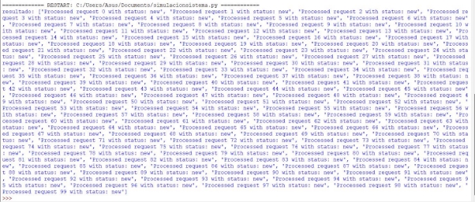

## **EJERCICIO 1:** Sistema de procesamiento de imágenes en tiempo real 
```
import os
from PIL import Image, ImageFilter


import time
from concurrent.futures import ThreadPoolExecutor
from functools import wraps


def convert_to_grayscale(image):
    """Convierte la imagen a escala de grises."""
    return [image.convert('L')]


def apply_edge_detection(image):
    """Aplica detección de bordes a la imagen."""
    return [image.filter(ImageFilter.FIND_EDGES)]

def time_it(func):
    """Decorador que mide el tiempo de ejecución de una función."""
    @wraps(func)
    def wrapper(*args, **kwargs):
        start = time.time()
        result = func(*args, **kwargs)
        end = time.time()
        print(f"{func.__name__} took {end - start:.2f} seconds to run.")
        return result
    return wrapper


def parallelize_image_processing(function):
    """Decorador que paraleliza el procesamiento de imágenes."""
    @wraps(function)
    def wrapper(images):
        with ThreadPoolExecutor(max_workers=5) as executor:
            results = list(executor.map(function, images))
        return results
    return wrapper

import asyncio
@time_it
@parallelize_image_processing
def process_images(images):
    """Procesa una lista de imágenes aplicando las funciones de procesamiento."""
    processed_images = [convert_to_grayscale(img)[0] for img in images]
    processed_images = [apply_edge_detection(img)[0] for img in processed_images]
    return processed_images


async def main():
    # Simulando la carga de imágenes
    #images = [Image.open(f'cat_{i}.jpg') for i in range(10)]  # Asegúrate de tener imágenes disponibles
    #processed_images = process_images(images)
    # Simulando la carga de imágenes
    folder_path = r'C:\Users\Asus\Downloads\archive\data\cats'
    images = []
    for i in range(202):
        image_path = os.path.join(folder_path, f'cat.{i+1}.jpg')
        try:
            image = Image.open(image_path)
            images.append([image])
        except FileNotFoundError:
            print(f"No se encontró la imagen {image_path}")
    processed_images = process_images(images)


    # Guardar
    output = r'C:\Users\Asus\Downloads\archive\data\cats_pro'
    for i, processed_image_list in enumerate(processed_images):
        processed_image = processed_image_list[0]
        processed_image.save(os.path.join(output, f'cats_pro.{i+1}.jpg'))
    # Aquí podrías guardar las imágenes procesadas o enviarlas a otro servicio


if __name__ == "__main__":
    asyncio.run(main())

```

#### **Resultado:**


Dataset Cats de 202 imagenes= <https://www.kaggle.com/datasets/pavansanagapati/images-dataset/data>

 

## **EJERCICIO 2:** Simulación de sistema de reservas con alta concurrencia
```
def add_reservation(reservations, reservation):
    """Agrega una nueva reserva a la lista de reservas de manera inmutable."""
    return reservations + [reservation]

def cancel_reservation(reservations, reservation_id):
    """Cancela una reserva por ID, inmutablemente."""
    return [res for res in reservations if res['id'] != reservation_id]

def update_reservation(reservations, reservation_id, new_details):
    """Actualiza una reserva por ID, inmutablemente."""
    return [res if res['id'] != reservation_id else {**res, **new_details} for res in reservations]
from concurrent.futures import ThreadPoolExecutor
import copy
import time
import random

def process_booking_requests(requests):
    """Procesa una lista de solicitudes de reserva concurrentemente."""
    with ThreadPoolExecutor(max_workers=5) as executor:
        results = list(executor.map(handle_request, requests))
    return results


def handle_request(request):
    """Maneja una solicitud individual simulando cierta lógica y tiempo de procesamiento."""
    # Simulación de procesamiento: modificar según la lógica de negocio
    time.sleep(random.uniform(0.1, 0.5))  # Simular tiempo de procesamiento
    return f"Processed request {request['id']} with status: {request['status']}"

import asyncio

async def manage_reservations(requests):
    """Gestiona reservas asincrónicamente."""
    loop = asyncio.get_running_loop()
    future = loop.run_in_executor(None, process_booking_requests, requests)
    result = await future
    print("resultado:",result)


async def simulate_requests():
    """Simula la llegada de solicitudes de reserva."""
    requests = [{'id': i, 'status': 'new'} for i in range(100)]  # Simular 10 solicitudes
    await manage_reservations(requests)

if __name__ == "__main__":
    asyncio.run(simulate_requests())

```

#### **RESULTADO:** Con 100 solicitudes



## **Ejercicio 4:** Sistema de análisis de sentimiento en tiempo real para redes sociales
```
import re
import nltk
nltk.download('punkt')
from nltk.corpus import stopwords
from nltk.tokenize import word_tokenize
stop_words = set(stopwords.words('english'))

def clean_text(text):
    """Limpia el texto eliminando caracteres especiales y convirtiéndolo a minúsculas."""
    text = re.sub(r'\W', ' ', text)
    text = text.lower()
    return text

def remove_stopwords(text):
    """Elimina las stopwords de un texto."""
    words = word_tokenize(text)
    filtered_words = [word for word in words if word not in stop_words]
    return ' '.join(filtered_words)

def preprocess_text(text):
    """Combina todas las operaciones de preprocesamiento de texto."""
    text = clean_text(text)
    text = remove_stopwords(text)
    return text
from textblob import TextBlob
def analyze_sentiment(text):
    """Analiza el sentimiento de un texto dado y devuelve el resultado."""
    analysis = TextBlob(text)
    return analysis.sentiment
from concurrent.futures import ThreadPoolExecutor

def analyze_texts_concurrently(texts):
    """Analiza una lista de textos concurrentemente."""
    with ThreadPoolExecutor(max_workers=10) as executor:
        results = list(executor.map(preprocess_and_analyze, texts))
    return results

def preprocess_and_analyze(text):
    """Preprocesa y analiza el sentimiento de un texto."""
    preprocessed_text = preprocess_text(text)
    sentiment = analyze_sentiment(preprocessed_text)
    return sentiment
import asyncio

async def collect_and_process_data(stream_data):
    """Asíncronamente recolecta y procesa datos de un flujo."""
    processed_data = await asyncio.get_event_loop().run_in_executor(None, analyze_texts_concurrently, stream_data)
    print("Sentiment Analysis Results:", processed_data)

async def simulate_streaming_data():
    """Simula la llegada de datos de texto de un flujo en tiempo real."""
    sample_data = [
        "This video is amazing! I love it.",
        "I'm fed up with this. I can't believe what's happening.",
        "Wow! I never expected to see something like this.",
        "This is so sad. I can't help but feel bad for them.",
        "Sending love and support from here. Stay strong!",
        "Incredible! You really left me speechless."
    ]
    await collect_and_process_data(sample_data)


if __name__ == "__main__":
    asyncio.run(simulate_streaming_data())

```
#### **RESULTADOS:** De 6 comentarios de un video.
```
Sentiment Analysis Results: [Sentiment(polarity=0.55, subjectivity=0.75), Sentiment(polarity=0.0, subjectivity=0.0), Sentiment(polarity=0.07500000000000001, subjectivity=0.7), Sentiment(polarity=-0.5999999999999999, subjectivity=0.8333333333333333), Sentiment(polarity=0.4666666666666667, subjectivity=0.6666666666666666), Sentiment(polarity=0.45, subjectivity=0.45)]
```
## **Ejercicio 5:** Plataforma de análisis de datos genómicos distribuidos
```
def filter_variants(variants, min_depth=10, min_quality=20):
    """Filtra variantes genéticas basadas en profundidad y calidad."""
    return [variant for variant in variants if variant['depth'] >= min_depth and variant['quality'] >= min_quality]

def calculate_allele_frequencies(variants):
    """Calcula las frecuencias alélicas de un conjunto de variantes genéticas."""
    allele_counts = {}
    for variant in variants:
        alleles = variant['alleles']
        for allele in alleles:
            if allele in allele_counts:
                allele_counts[allele] += 1
            else:
                allele_counts[allele] = 1
    total_alleles = sum(allele_counts.values())
    return {allele: count / total_alleles for allele, count in allele_counts.items()}
from multiprocessing import Pool

def process_genomic_data(data):
    """Procesa datos genómicos en paralelo utilizando múltiples procesos."""
    with Pool(processes=4) as pool:
        results = pool.map(process_sample, data)
    return results

def process_sample(sample):
    """Procesa un único conjunto de datos genómicos."""
    filtered_variants = filter_variants(sample['variants'])
    allele_frequencies = calculate_allele_frequencies(filtered_variants)
    return {'sample_id': sample['id'], 'allele_frequencies': allele_frequencies}
import asyncio

async def load_genomic_data(file_path):
    """Carga datos genómicos de forma asíncrona."""
    # Simulación: en un caso real, se leerían los datos de un archivo
    return [
        {'id': 'sample1', 'variants': [{'depth': 15, 'quality': 30, 'alleles': ['A', 'T']}, {'depth': 20, 'quality': 25, 'alleles': ['G', 'C']}]},
        {'id': 'sample2', 'variants': [{'depth': 12, 'quality': 22, 'alleles': ['T', 'T']}, {'depth': 18, 'quality': 28, 'alleles': ['A', 'C']}]},
        {'id': 'sample3', 'variants': [{'depth': 18, 'quality': 26, 'alleles': ['A', 'T']}, {'depth': 22, 'quality': 35, 'alleles': ['C', 'G']}]},
        {'id': 'sample4', 'variants': [{'depth': 14, 'quality': 21, 'alleles': ['G', 'G']}, {'depth': 16, 'quality': 28, 'alleles': ['T', 'C']}]},
        {'id': 'sample5', 'variants': [{'depth': 20, 'quality': 30, 'alleles': ['A', 'C']}, {'depth': 25, 'quality': 28, 'alleles': ['G', 'T']}]},
        {'id': 'sample6', 'variants': [{'depth': 16, 'quality': 24, 'alleles': ['G', 'A']}, {'depth': 21, 'quality': 32, 'alleles': ['T', 'C']}]},
        {'id': 'sample7', 'variants': [{'depth': 18, 'quality': 26, 'alleles': ['T', 'T']}, {'depth': 22, 'quality': 35, 'alleles': ['C', 'C']}]},
        {'id': 'sample8', 'variants': [{'depth': 14, 'quality': 21, 'alleles': ['C', 'A']}, {'depth': 16, 'quality': 28, 'alleles': ['T', 'G']}]},
        {'id': 'sample9', 'variants': [{'depth': 20, 'quality': 30, 'alleles': ['G', 'T']}, {'depth': 25, 'quality': 28, 'alleles': ['A', 'C']}]},
        {'id': 'sample10', 'variants': [{'depth': 16, 'quality': 24, 'alleles': ['T', 'T']}, {'depth': 21, 'quality': 32, 'alleles': ['C', 'A']}]},
        {'id': 'sample11', 'variants': [{'depth': 18, 'quality': 26, 'alleles': ['A', 'C']}, {'depth': 22, 'quality': 35, 'alleles': ['T', 'G']}]},
        {'id': 'sample12', 'variants': [{'depth': 14, 'quality': 21, 'alleles': ['G', 'A']}, {'depth': 16, 'quality': 28, 'alleles': ['C', 'T']}]}
    ]

async def analyze_genomic_data(file_path):
    """Analiza datos genómicos utilizando funciones asincrónicas y paralelismo."""
    data = await load_genomic_data(file_path)
    results = await asyncio.get_event_loop().run_in_executor(None, process_genomic_data, data)
    for result in results:
        print(result)


if __name__ == "__main__":
    asyncio.run(analyze_genomic_data('path_to_genomic_data.txt'))
```
**Resultados de 12 datos genómicos:**
```
{'sample\_id': 'sample1', 'allele\_frequencies': {'A': 0.25, 'T': 0.25, 'G': 0.25, 'C': 0.25}} {'sample\_id': 'sample2', 'allele\_frequencies': {'T': 0.5, 'A': 0.25, 'C': 0.25}} {'sample\_id': 'sample3', 'allele\_frequencies': {'A': 0.25, 'T': 0.25, 'C': 0.25, 'G': 0.25}} {'sample\_id': 'sample4', 'allele\_frequencies': {'G': 0.5, 'T': 0.25, 'C': 0.25}} {'sample\_id': 'sample5', 'allele\_frequencies': {'A': 0.25, 'C': 0.25, 'G': 0.25, 'T': 0.25}} {'sample\_id': 'sample6', 'allele\_frequencies': {'G': 0.25, 'A': 0.25, 'T': 0.25, 'C': 0.25}} {'sample\_id': 'sample7', 'allele\_frequencies': {'T': 0.5, 'C': 0.5}}

{'sample\_id': 'sample8', 'allele\_frequencies': {'C': 0.25, 'A': 0.25, 'T': 0.25, 'G': 0.25}} {'sample\_id': 'sample9', 'allele\_frequencies': {'G': 0.25, 'T': 0.25, 'A': 0.25, 'C': 0.25}} {'sample\_id': 'sample10', 'allele\_frequencies': {'T': 0.5, 'C': 0.25, 'A': 0.25}} {'sample\_id': 'sample11', 'allele\_frequencies': {'A': 0.25, 'C': 0.25, 'T': 0.25, 'G': 0.25}} {'sample\_id': 'sample12', 'allele\_frequencies': {'G': 0.25, 'A': 0.25, 'C': 0.25, 'T': 0.25}}
```
## ** Ejercicio 6:** Simulador de mercados financieros en tiempo real
```
def calculate_moving_average(prices, window_size=14):
    """Calcula la media móvil simple de los precios."""
    if len(prices) < window_size:
        return None  # No hay suficientes datos para calcular la media móvil
    return sum(prices[-window_size:]) / window_size

def calculate_rsi(prices, periods=8):
    """Calcula el índice de fuerza relativa (RSI) para una lista de precios."""
    if len(prices) < periods:
        return None  # No hay suficientes datos para calcular el RSI
    gains = [max(0, prices[i] - prices[i - 1]) for i in range(1, len(prices))]
    losses = [max(0, prices[i - 1] - prices[i]) for i in range(1, len(prices))]
    average_gain = sum(gains[-periods:]) / periods
    average_loss = sum(losses[-periods:]) / periods

    if average_loss == 0:
        return 100  # Evitar división por cero
    rs = average_gain / average_loss
    rsi = 100 - (100 / (1 + rs))
    return rsi

from concurrent.futures import ThreadPoolExecutor

def parallel_analyze_data(stock_data):
    """Analiza datos bursátiles en paralelo."""
    with ThreadPoolExecutor(max_workers=10) as executor:
        results = list(executor.map(analyze_stock, stock_data))
    return results

def analyze_stock(data):
    """Analiza los datos de un solo stock."""
    moving_average = calculate_moving_average(data['prices'])
    rsi = calculate_rsi(data['prices'])
    return {'stock': data['stock'], 'moving_average': moving_average, 'RSI': rsi}

import asyncio

async def stream_stock_data():
    """Simula la recepción de datos bursátiles en tiempo real."""
    example_data = [
        {'stock': 'AAPL', 'prices': [150, 151, 152, 153, 154, 155, 156, 157, 158, 159, 160, 161, 162, 163, 164]},
        {'stock': 'GOOGL', 'prices': [120, 121, 122, 123, 124, 125, 126, 127, 128, 129, 130, 131, 132, 133, 134]},
        {'stock': 'MSFT', 'prices': [250, 251, 249, 252, 253, 254, 255, 256, 257, 258, 259, 260, 261, 262, 263]},
        {'stock': 'AMZN', 'prices': [330, 332, 334, 336, 338, 340, 342, 344, 346, 348, 350, 352, 354, 356, 358]},
        {'stock': 'TSLA', 'prices': [600, 605, 610, 615, 620, 625, 630, 635, 640, 645, 650, 655, 660, 665, 670]},
        {'stock': 'NFLX', 'prices': [550, 552, 554, 556, 558, 560, 562, 564, 566, 568, 570, 572, 574, 576, 578]},
        {'stock': 'FB', 'prices': [320, 321, 322, 323, 324, 325, 326, 327, 328, 329, 330, 331, 332, 333, 334]},
        {'stock': 'NVDA', 'prices': [700, 702, 704, 706, 708, 710, 712, 714, 716, 718, 720, 722, 724, 726, 728]},
        {'stock': 'V', 'prices': [220, 221, 222, 223, 224, 225, 226, 227, 228, 229, 230, 231, 232, 233, 234]},
        {'stock': 'JPM', 'prices': [150, 151, 152, 153, 154, 155, 156, 157, 158, 159, 160, 161, 162, 163, 164]}
    ]
    while True:
        await asyncio.sleep(1)  # Simular la recepción de datos cada segundo
        processed_data = await asyncio.get_event_loop().run_in_executor(None, parallel_analyze_data, example_data)
        print("Processed Data:", processed_data)


if __name__ == "__main__":
    asyncio.run(stream_stock_data())

```
#### **Resultado con 10 datos bursátiles:**
```
Processed Data: [{'stock': 'AAPL', 'moving\_average': 157.5, 'RSI': 100}, {'stock': 'GOOGL', 'moving\_average': 127.5, 'RSI': 100}, {'stock': 'MSFT', 'moving\_average': 256.42857142857144, 'RSI': 100}, {'stock': 'AMZN', 'moving\_average': 345.0, 'RSI': 100}, {'stock': 'TSLA', 'moving\_average': 637.5, 'RSI': 100}, {'stock': 'NFLX', 'moving\_average':

 565.0, 'RSI': 100}, {'stock': 'FB', 'moving\_average': 327.5, 'RSI': 100},

{'stock': 'NVDA', 'moving\_average': 715.0, 'RSI': 100}, {'stock': 'V', 'moving\_average': 227.5, 'RSI': 100}, {'stock': 'JPM', 'moving\_average': 157.5, 'RSI': 100}]
```
