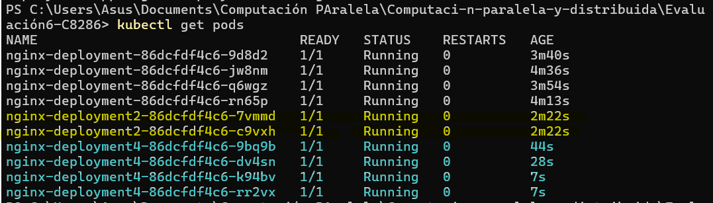
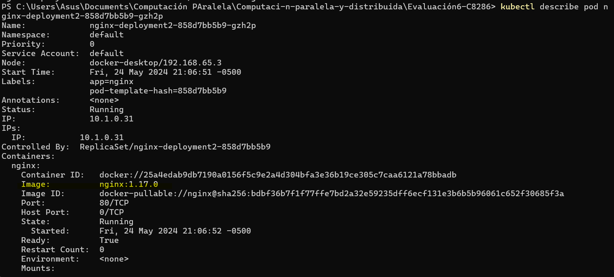
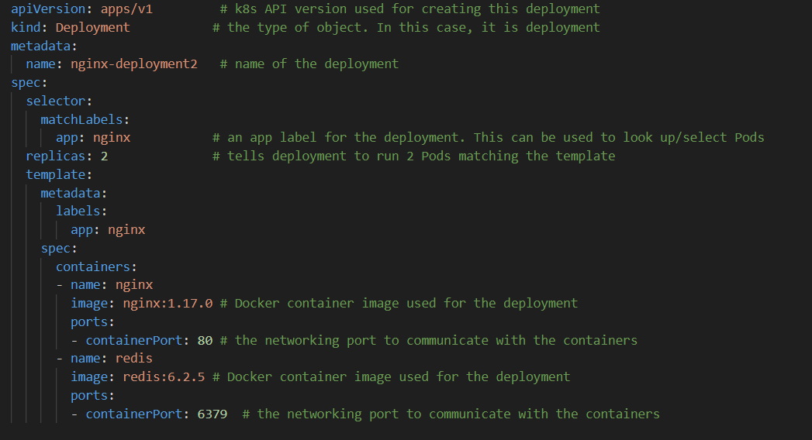
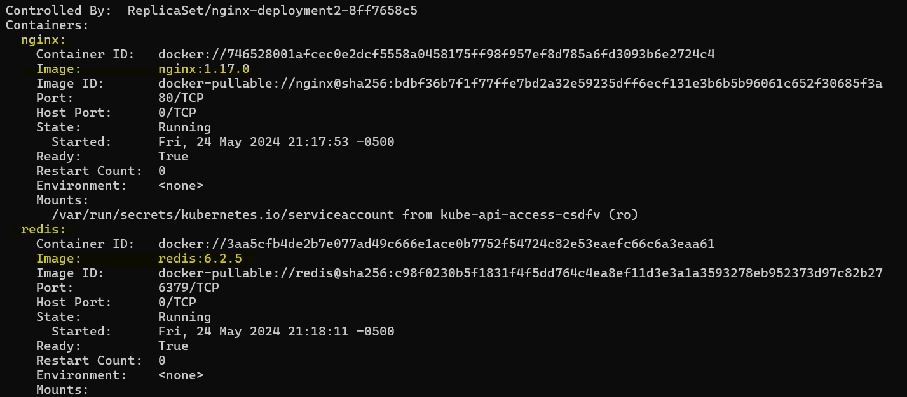

## Ejercicio1 :
##### Modificar el número de réplicas:
• Cambia el número de réplicas en el Deployment de 2 a 4 y explica qué efecto tiene esto
en el clúster

Esto indica que el clúster ha creado los nuevos pods necesarios para cumplir con el nuevo número de réplicas especificado en el Deployment.

##### Actualizar la imagen del contenedor:
• Actualiza la imagen de Nginx de la versión 1.14.2 a 1.17.0. Aplica el cambio y verifica que
los Pods estén utilizando la nueva imagen.

##### Agregar un nuevo contenedor al Pod:
• Modifica el Deployment para agregar un segundo contenedor dentro de cada Pod, por
ejemplo, un contenedor de redis. Explica cómo cambiarías el archivo YAML y qué
consideraciones debes tener en cuenta para la comunicación entre los contenedores
dentro del mismo Pod.

* Modificar el archivo YAML para incluir la configuración del nuevo contenedor dentro del mismo spec.containers

