# **Lab: Querying Data by Using Athena**

Athena es un servicio de consulta interactivo que se puede utilizar para consultar datos almacenados en Amazon S3. Athena almacena datos sobre las fuentes de datos que consulta. Puede almacenar sus consultas para reutilizarlas y compartirlas con otros usuarios.

En esta práctica de laboratorio, asumirá el rol de miembro del equipo de ciencia de datos. Donde experimentará con Athena accediendo a datos sin procesar en un depósito de S3, creando una base de datos de AWS Glue y consultando esta base de datos mediante Athena.

## **Tarea 1: Crear y consultar una base de datos y una tabla de AWS Glue en Athena**

\1) Buscar Athena y abrir la consola\. Además, especifique un depósito de S3 para los resultados de la consulta\.

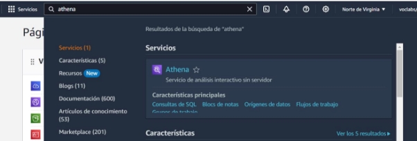

En la consola de Athena, elija Explorar el editor de consultas. Luego, elige la pestaña Configuración. Después, en la sección Resultado de la consulta y configuración de cifrado, elija Administrar. Asimismo, configurar el depósito y guardar.

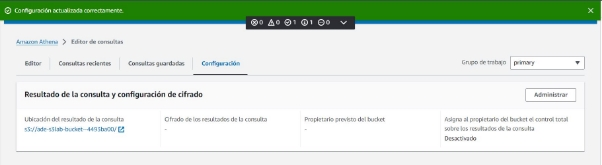

Luego de ello, elige la pestaña Editor. En la sección Consulta 1, ingrese el siguiente comando SQL: CREATE DATABASE taxidata;. Después, ejecutar y mostrará un mensaje de Consulta exitosa y se crea una base de datos de AWS Glue denominada taxidata.

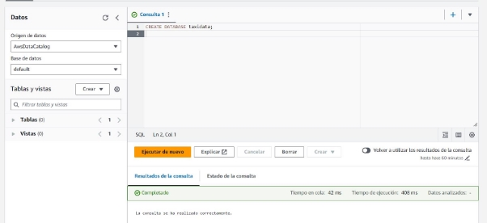

Para confirmar que la base de datos se creó en AWS Glue, abra una nueva pestaña y navegue hasta la consola de AWS Glue. Y efectivamente encontramos la base de datos.

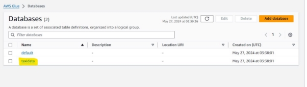

A continuación, creará una tabla en la base de datos de AWS Glue e importará datos. Para ello, lo configuramos de la siguiente manera:

Nombre de la tabla: yellow

- Descripción: Ingresar Table for taxi data
- Configuración de la base de datos: seleccione Elegir una base de datos existente y luego elija datos de taxidata desplegable.
- Ubicación del conjunto de datos de entrada: copie el siguiente enlace en el campo: s3://aws-tc-largeobjects/CUR-TF-200-ACDSCI-1/Lab2/amarillo/
- Cifrado: mantenga la configuración predeterminada, que no está seleccionada.
- Formato de datos: elija CSV.

En la sección Detalles de la columna, elija Agregar columnas de forma masiva. Y colocar el el siguiente texto. Por último, **Create table**.

vendor string, pickup timestamp, dropoff timestamp, count int,

distance int, ratecode string, storeflag string, pulocid string, dolocid string, paytype string, fare decimal,

extra decimal, mta\_tax decimal, tip decimal,

tolls decimal, surcharge decimal, total decimal

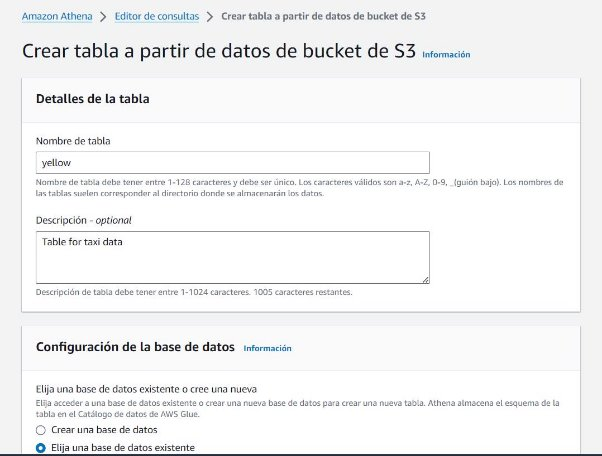

En la sección vista previa de la Consulta de la tabla , vea el texto de la consulta de la tabla de vista previa, que coincide con el siguiente texto:

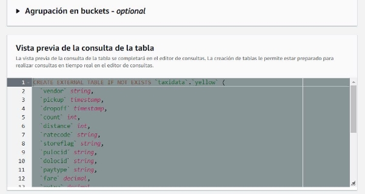

En la sección Tablas, a la derecha de yellow table elija el ícono de puntos suspensivos (tres puntos) y luego elija Vista previa de tabla.

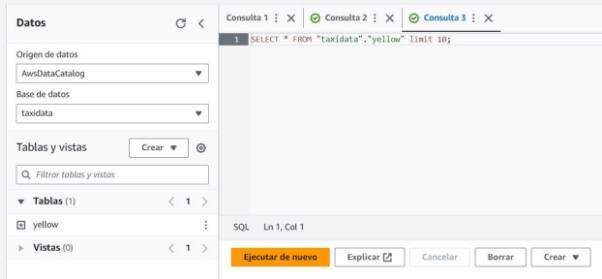

La sección Resultados muestra los primeros 10 registros de la tabla.

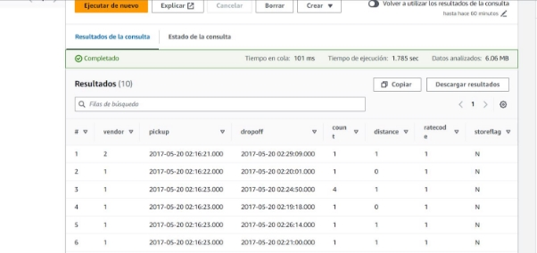

## **Tarea 2: Optimización de consultas de Athena mediante el uso de depósitos**

El costo de Athena se basa en el uso, que es la cantidad de datos que se escanean, y los precios varían según su región.

Tres posibles estrategias que puede utilizar para minimizar sus costos y mejorar el rendimiento son comprimir datos, agruparlos y particionarlos.

Para abrir una nueva pestaña de consulta, elija el ícono (+) en el lado derecho de la sección de consulta.

Copie y pegue el siguiente texto en la nueva pestaña de consulta y luego elija Ejecutar:

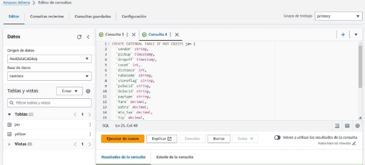

Aparece el mensaje Consulta exitosa. Athena creó una nueva tabla denominada jan, que contiene los datos de taxidata sólo para el mes de enero de 2017. La tabla aparece en la sección Tablas a la izquierda.

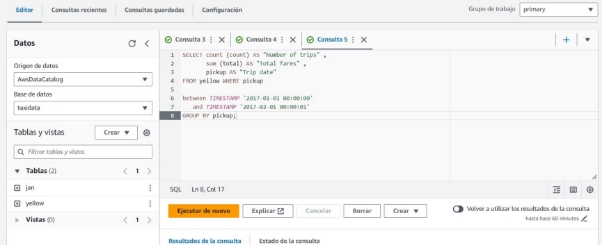

Ejecuta la siguiente consulta en el yellow table, que tiene datos para todo el año. Los datos no se dividen en grupos mensuales.

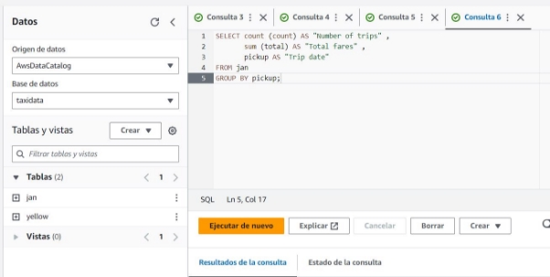

Aparece el mensaje Consulta exitosa.

## **Tarea 3: Optimización de consultas de Athena mediante el uso de particiones**

Crea una partición ejecutando una consulta para seleccionar los datos que desea usar para una partición e indicar un formato de almacenamiento.

Para crear una nueva tabla llamada taxidata.creditcard que esté particionada para paytype = 1 (transacciones con tarjeta de crédito), ejecute la siguiente consulta en una nueva pestaña de consulta:

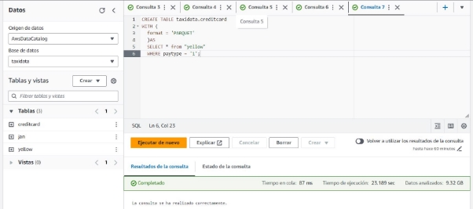

Los valores de tiempo de ejecución y datos escaneados son similares a los siguientes: Tiempo en cola: 81 ms

Tiempo de ejecución: 23,189 segundos

Datos escaneados: 9,32 GB

Ahora comparará el rendimiento de ejecutar consultas sobre los datos no particionados en el yellow table y los datos particionados en la tabla de tarjetas de crédito.

Para consultar los datos no particionados en yellow table, ejecute la siguiente consulta en una nueva pestaña de consulta:

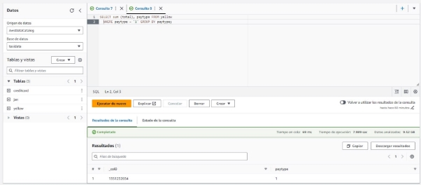

Los valores de tiempo de ejecución y datos escaneados son similares a los siguientes:

Tiempo en cola: 69 ms

Tiempo de ejecución: 7.989 segundos Datos escaneados: 9,32 GB

Para consultar los datos particionados en la tabla de tarjetas de crédito, ejecute la siguiente consulta en una nueva pestaña de consulta:

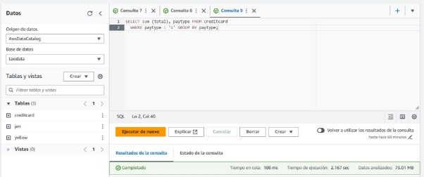

Los valores de tiempo de ejecución y datos escaneados son similares a los siguientes:

Tiempo en cola: 108 ms

Tiempo de ejecución: 2.167 segundos Datos escaneados: 73,01 MB

Análisis: observe que los resultados de cada consulta son los mismos, pero la consulta de los datos particionados tomó mucho menos tiempo porque escaneó menos datos. Recuerde que se le cobrará por la cantidad de datos escaneados para cada consulta. Entonces, dado que la última consulta escanea menos datos debido al uso de particiones, su costo se reduce.

## **Tarea 4: uso de vistas de Athena**

Athena puede crear vistas. Crear y utilizar vistas con datos puede ayudar a simplificar el análisis porque puede ocultar parte de la complejidad de las consultas a los usuarios.

Para crear una vista del valor total en dólares de las tarifas pagadas con tarjeta de crédito, ejecute la siguiente consulta:

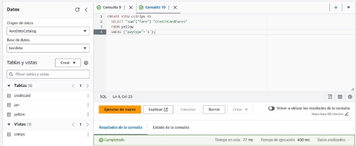

Los valores de tiempo de ejecución y datos escaneados son similares a los siguientes:

Tiempo en cola: 77 ms Tiempo de ejecución: 490 ms Datos escaneados: -

Para crear una vista del valor total en dólares de las tarifas pagadas en efectivo, ejecute la siguiente consulta:

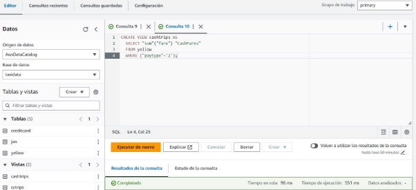

Los valores de tiempo de ejecución y datos escaneados son similares a los siguientes:

Tiempo en cola: 96 ms

Tiempo de ejecución: 551 ms

Datos escaneados: -

Observe que la sección Vistas a la izquierda ahora enumera las dos vistas que creó: cctrips y cashtrips.

Para seleccionar todos los registros de la vista cctrips, ejecute la siguiente consulta:

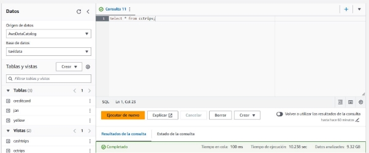

Los valores de tiempo de ejecución y datos escaneados son similares a los siguientes:

Tiempo en cola: 100 ms

Tiempo de ejecución: 10.238 segundos Datos escaneados: 9,32 GB

Para seleccionar todos los registros de la vista Cashtrips, ejecute la siguiente consulta:

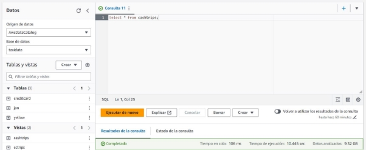

Los valores de tiempo de ejecución y datos escaneados son similares a los siguientes:

Tiempo en cola: 106 ms

Tiempo de ejecución: 10.445 segundos

Datos escaneados: 9,32 GB

Ahora aprenderá cómo crear una vista que una datos de dos vistas diferentes.

Para crear una nueva vista que una los datos, ejecute la siguiente consulta:

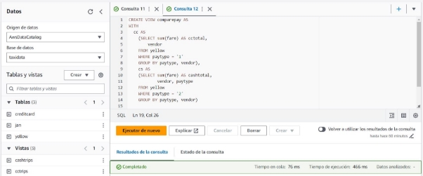

Los valores de tiempo de ejecución y datos escaneados son similares a los siguientes:

Tiempo en cola: 76 ms Tiempo de ejecución: 466 ms Datos escaneados: -

Obtenga una vista previa de los resultados de la unión.

En la sección Vistas a la izquierda, a la derecha de la vista de comparación de pago, elija el ícono de puntos suspensivos y luego elija Vista previa.

Y se mostrará lo siguiente.

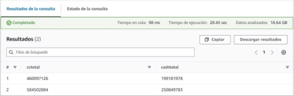

**Tarea 5: Crear consultas con nombre de Athena mediante CloudFormation**

El equipo de ciencia de datos quiere compartir las consultas que crearon utilizando el conjunto de datos de taxidata. Al equipo le gustaría compartir con otros departamentos, pero esos departamentos utilizan otras cuentas en AWS.

Mary le proporciona la siguiente consulta de ejemplo:

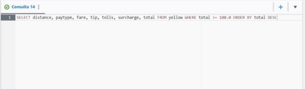

Esta consulta utiliza la tabla yellow de la base de datos de taxidata. La consulta realiza las siguientes acciones:

Selecciona todos los registros en la tabla yellow donde el cargo total es mayor o igual a $100.00

Muestra los registros en orden descendente por campo total (por lo que el viaje más caro se muestra primero en los resultados)

Los resultados son similares a la siguiente imagen:

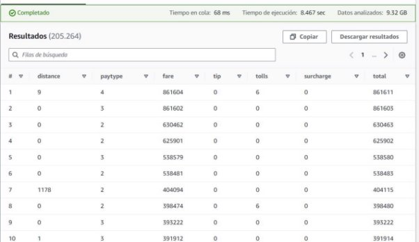

Navegue hasta el entorno de desarrollo integrado (IDE) de AWS Cloud9.

En la Consola de administración de AWS, en el cuadro de búsqueda junto a Servicios, busque y elija Cloud9 para abrir la consola de AWS Cloud9.

En el IDE de AWS Cloud9, elija Archivo > Nuevo archivo.

Guarde el archivo vacío como athenaquery.cf.yml pero manténgalo abierto.

Colocar el siguiente código en el archivo y guárdelo:

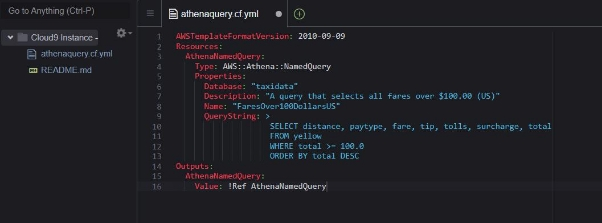

Esta plantilla creará una pila de CloudFormation que hace lo siguiente:

- Crea una consulta de Athena
- Utiliza una base de datos preexistente en Athena llamada taxidata (Nota: para que otro usuario utilice esta plantilla, la base de datos de taxidata ya debe existir en su cuenta de AWS).
- Nombra la consulta FaresOver100DollarsUS
- Utiliza la consulta de ejemplo que probó anteriormente en esta tarea.
- Envía los detalles de la consulta a la pestaña Salidas de la pila una vez que se crea la pila.

Para validar la plantilla de CloudFormation, ejecute el siguiente comando en la terminal AWS Cloud9:

Ahora utilizará la plantilla para crear una pila de CloudFormation. Una pila implementa y gestiona el grupo de recursos que se describen en una plantilla.

Para crear la pila, ejecute el siguiente comando:

El comando create-stack de CloudFormation crea la pila y la implementa.

Para verificar que se creó la consulta nombrada, ejecute el siguiente comando en la terminal AWS Cloud9.

El ID de consulta con nombre es un identificador único en AWS para la consulta que creó mediante la pila de CloudFormation.

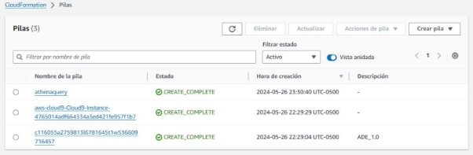

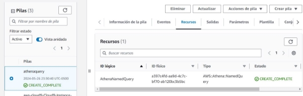

Para recuperar los detalles de la consulta nombrada, incluida la declaración SQL asociada a ella, ejecute el siguiente comando. Reemplace <QUERY-ID> con el ID que guardó en un editor de texto.

## **Tarea 6. Revise la política de Política para científicos de datos en IAM.**

- En el cuadro de búsqueda a la derecha de Servicios, busque y elija IAM para abrir la consola de IAM.
- En el panel de navegación, elija Usuarios.
- Observe que Mary es uno de los usuarios de IAM que figuran en la lista. Este usuario forma parte del grupo IAM de DataScienceGroup.
- Elija el enlace del nombre de usuario de mary.
- En la pestaña Permisos, elija el enlace de la política Política para científicos de datos.
- Se abre la página de detalles de Políticas para científicos de datos. Revise los permisos asociados con esta política. Tenga en cuenta que los permisos proporcionan acceso limitado únicamente a los servicios Athena, CloudFormation, Cloud9, AWS Glue y Amazon S3.

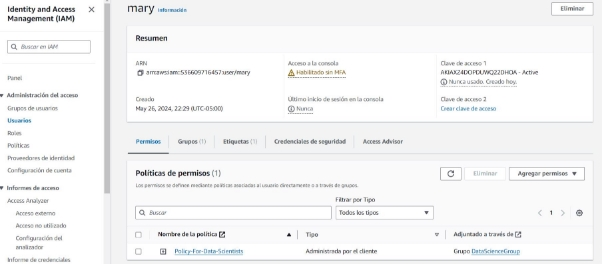

## **Tarea 7: Confirmar que Mary puede acceder y utilizar la consulta nombrada**

En el cuadro de búsqueda junto a Servicios, busque y elija CloudFormation. En el panel de navegación, elija Pilas.

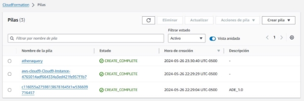

Elija el vínculo de la pila que creó el entorno de laboratorio. El nombre de la pila incluye una cadena aleatoria de letras y números, y la pila debe tener la hora de creación más antigua.

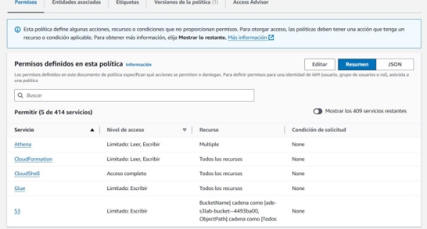

En la página de detalles de la pila, elija la pestaña Salidas.

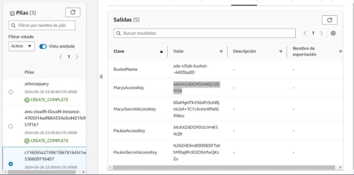

Copie el valor de MarysAccessKey a su portapapeles.

Regrese a la terminal AWS Cloud9.

Para crear una variable para la clave de acceso, ejecute el siguiente comando. Reemplace <ACCESS-KEY> con el valor de su portapapeles.

Regrese a la consola de CloudFormation y copie el valor de MarysSecretAccessKey en su portapapeles.Regrese a la terminal AWS Cloud9.

Para crear una variable para la clave de acceso secreta, ejecute el siguiente comando. Reemplace <SECRET-ACCESS-KEY> con el valor de su portapapeles.

Para probar si Mary puede usar la consulta nombrada, ejecute el siguiente comando: AWS\_ACCESS\_KEY\_ID=$AK AWS\_SECRET\_ACCESS\_KEY=$SAK aws athena get-named-query --named-query-id $NQ

El resultado es similar al siguiente.

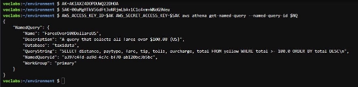

Este resultado confirma que Mary tiene acceso a la consulta con nombre que creó e implementó mediante CloudFormation.

## **Verificación del Knowledge Check:**

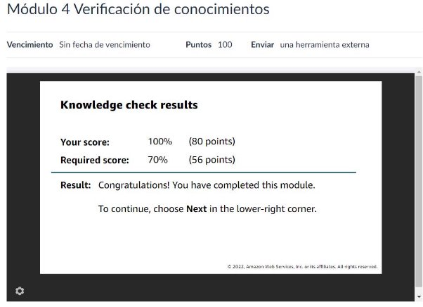

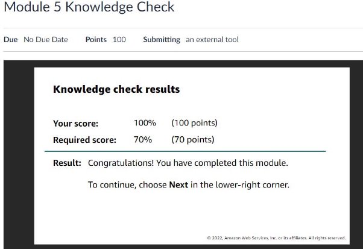

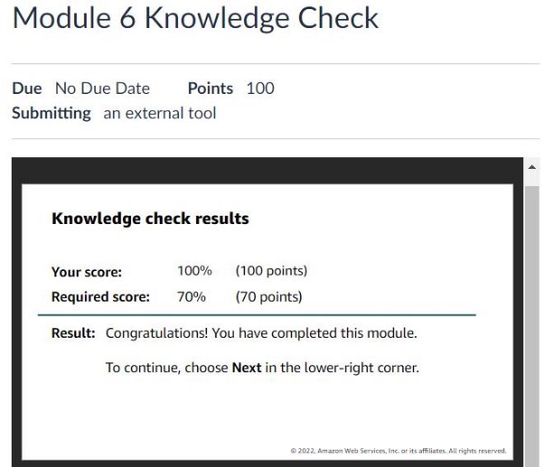
