**Lab: Performing ETL on a Dataset by Using AWS Glue**

AWS Glue es similar a Amazon Athena en que los datos reales que analiza permanecen en la fuente de datos. La diferencia clave es que puede crear un rastreador con AWS Glue para descubrir el esquema y luego extraer los datos del conjunto de datos. También puede transformar el esquema y luego cargar los datos en una base de datos de AWS Glue. Luego puede analizar los datos utilizando declaraciones SQL en Athena.

**Tarea 1: uso de un rastreador de AWS Glue con el conjunto de datos GHCN-D**

Primero, configurará y creará un rastreador para descubrir el esquema del conjunto de datos GHCN-D y extraer los datos del mismo.

- En el panel de navegación, en Bases de datos, elija Tablas.
- Elija Agregar tablas usando el rastreador.
- Para Nombre, ingrese Weather
- Elija **Siguiente** en la parte inferior de la página.

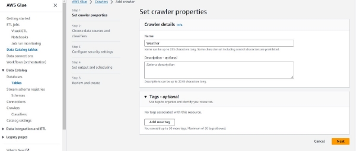

- Elija **Agregar una fuente de datos** y configure lo siguiente:
- Fuente de datos: elija S3.
- Ubicación de los datos de S3: elija En una cuenta diferente.
- Ruta de S3: ingrese la siguiente ubicación del depósito de S3 para el conjunto de datos disponible públicamente:

**○ s3://noaa-ghcn-pds/csv/by\_year/**

- Elija **S3 data source**.

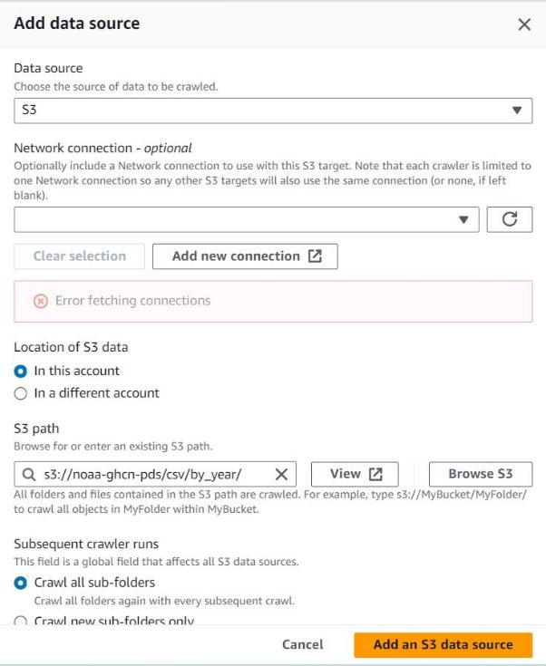

Elija **Next.**

Para la función **IAM role**, elija **gluelab**.

Esta función se le proporcionó en el entorno del laboratorio.

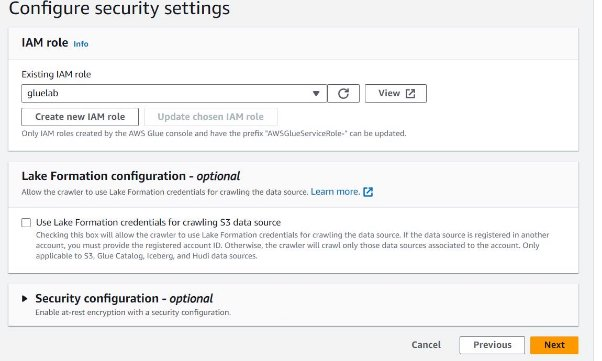

Elija **Next.**

Elija **Crear base de datos.**

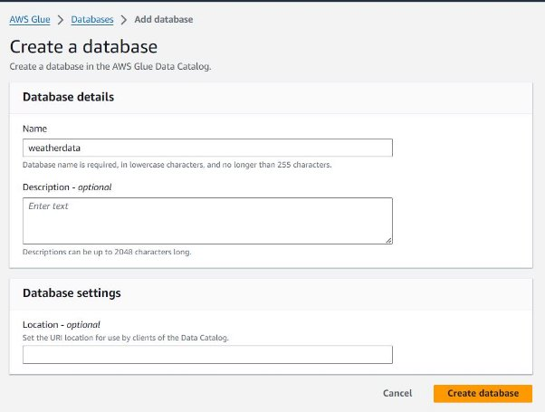

En la sección **Crawler**,mantenga el valor predeterminado. Elija **Next.**

Confirme que la configuración, elija **Create crawler.**

Puede crear rastreadores de AWS Glue para que se ejecuten bajo demanda o según un cronograma establecido. Debido a que creó su rastreador para ejecutarse bajo demanda, debe ejecutarlo para crear la base de datos y generar los metadatos.

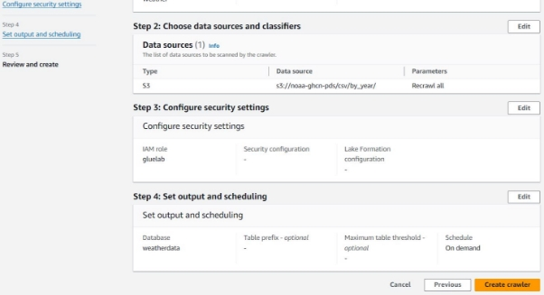

- Revise los metadatos que creó AWS Glue.
- En el panel de navegación, elija Bases de datos.
- Elija el enlace a la base de datos de datos meteorológicos.
- En la sección Tablas, elija **by\_year**.

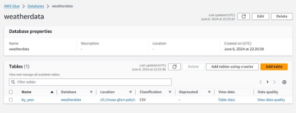

Revise los metadatos que capturó el rastreador meteorológico, como se muestra en la siguiente captura de pantalla.

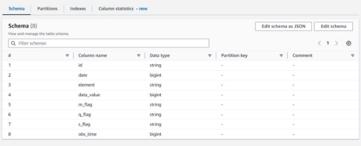

- Edite el esquema.
- En el menú Acciones en la esquina superior derecha de la página, elija Editar esquema.
- Cambie los nombres de las columnas según la siguiente tabla.
- Y actualizar.

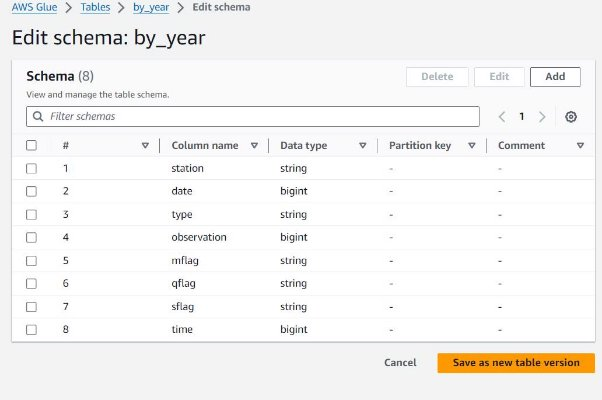

**Tarea 2: consultar una tabla mediante Athena**

Configure un depósito de S3 para almacenar los resultados de las consultas de Athena.

- En el panel de navegación, en Bases de datos, elija Tablas.
- Elija el enlace para la tabla
- Elija Acciones > Ver datos.
- Cuando aparezca la ventana emergente para advertirle que será redirigido a la consola de Athena, elija Continuar.

Vista previa de una tabla en Athena.

- Elija la pestaña Editor.
- En el panel Datos de la izquierda, observe que la fuente de datos es AwsDataCatalog.
- Para Base de datos, elija datos meteorológicos.
- En la sección Tablas, elija el ícono de puntos suspensivos (tres puntos) para la tabla por año y luego elija Vista previa de tabla.

  Se muestran los primeros 10 registros de la tabla de datos meteorológicos, similar a la siguiente captura de pantalla:

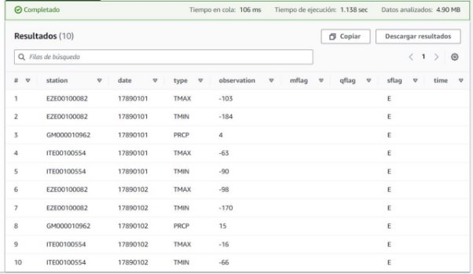

Cree una tabla para datos posteriores a 1950.

- Primero, debe recuperar el nombre del depósito que se creó para almacenar estos datos.
- En el cuadro de búsqueda junto a Servicios, busque y elija S3.
- En la lista Depósitos, copie el nombre del depósito que contiene pegamento-1950-bucket en un editor de texto de su elección.
- Regrese al editor de consultas de Athena.
- Copie y pegue la siguiente consulta en una pestaña de consulta en el editor. Reemplace <glue-1950-bucket> con el nombre del depósito que registró:

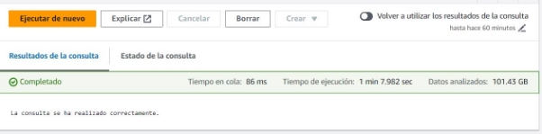

Después de ejecutar la consulta, los valores de tiempo de ejecución y datos analizados son similares a los siguientes:

Tiempo en cola: 86 ms

Tiempo de ejecución: 1 min 7.982 seg Datos escaneados: 101.43 GB

Para obtener una vista previa de los resultados, en la sección Tablas, a la derecha de la tabla late20th.

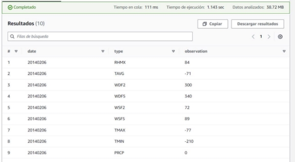

Ejecute una consulta en la nueva tabla.

- Primero, cree una vista que solo incluya la lectura de temperatura máxima, o valor TMAX.
- Ejecute la siguiente consulta en una nueva pestaña de consulta:

Para obtener una vista previa de los resultados, en la sección Vistas, a la derecha de la vista **tmax**, elija el icono de puntos suspensivos y luego elija Vista previa.

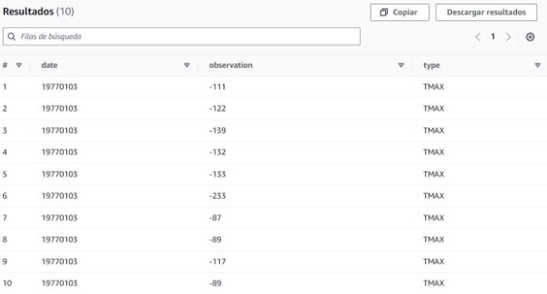

Ejecute la siguiente consulta en una nueva pestaña de consulta.

El propósito de esta consulta es calcular la temperatura máxima promedio para cada año en el conjunto de datos.

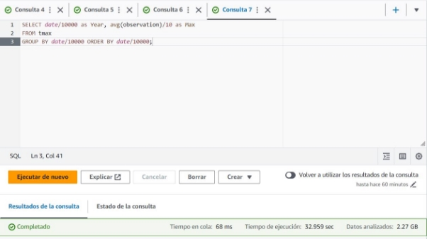

Después de ejecutar la consulta, los valores de tiempo de ejecución y datos analizados son similares a los siguientes:

Tiempo en cola: 68ms

Tiempo de ejecución: 32.959 sec Datos escaneados: 2,27 GB

Los resultados muestran la temperatura máxima promedio para cada año desde 1950 hasta 2015. La siguiente captura de pantalla :

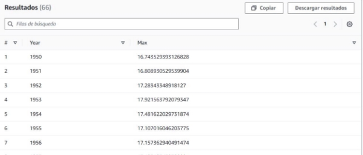

**Tarea 3: Crear una plantilla de CloudFormation para un rastreador de AWS Glue**

Busque el número de recurso de Amazon (ARN) para la función de IAM de Gluelab. Necesita este ARN para implementar la plantilla de CloudFormation.

- En el cuadro de búsqueda junto a Servicios, busque y elija IAM para abrir la consola de IAM.
- En el panel de navegación, elija Roles.
- Elija el enlace para el rol de Gluelab.

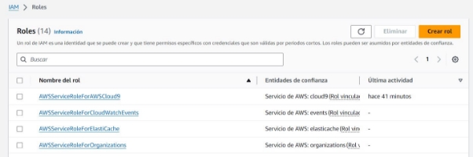

- El ARN se muestra en la página de la sección Resumen.
- Copie el ARN a un editor de texto para usarlo en el siguiente paso.

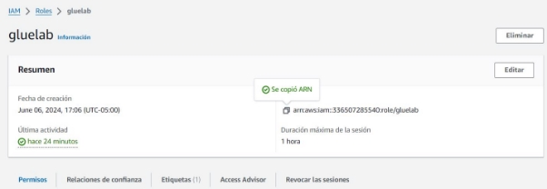

Navegue hasta el entorno de desarrollo integrado (IDE) de AWS Cloud9.

- Se abre una nueva pestaña del navegador y muestra el IDE de AWS Cloud9.
- Cree una nueva plantilla de CloudFormation.
- En el IDE de AWS Cloud9, elija Archivo > Nuevo archivo.
- Guarde el archivo vacío como **gluecrawler.cf.yml** pero manténgalo abierto.
- Copie y pegue el siguiente código en el archivo

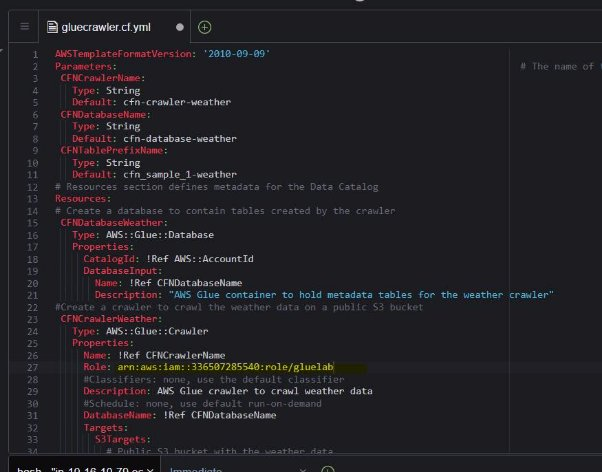

Para validar la plantilla de CloudFormation, ejecute el siguiente comando en la terminal AWS Cloud9: **aws cloudformation validate-template --template-body file://gluecrawler.cf.yml**

Si la plantilla está validada, se muestra el siguiente resultado:

Para crear la pila de CloudFormation, ejecute el siguiente comando

Si la pila está validada, el ARN de CloudFormation se muestra en el resultado, similar al siguiente:

Para verificar que la base de datos de AWS Glue se creó en la pila, ejecute el siguiente comando: **aws glue get-databases**

El resultado es similar al siguiente:

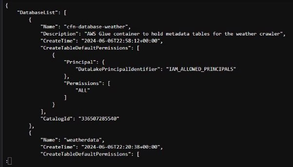

Verifique que el rastreador se haya creado en la pila. El resultado es similar al siguiente:

Para recuperar los detalles del rastreador, ejecute el siguiente comando. **aws glue get-crawler --name cfn-crawler-weather**

El resultado es similar al siguiente:

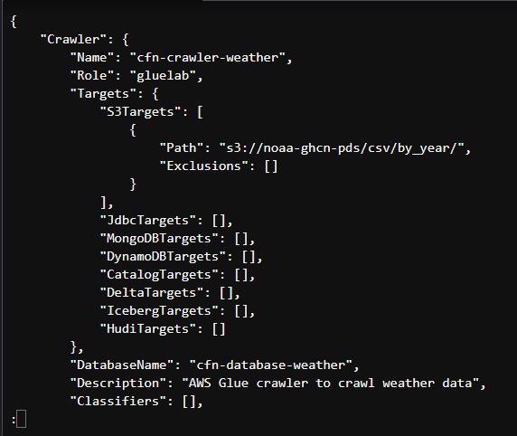

**Tarea 4: Revisión de la política de IAM para el acceso a Athena y AWS Glue**

Revise la política de Policy-For-Data-Scientists de datos en IAM.

- Elija el enlace para el grupo IAM de DataScienceGroup.
- En la página de detalles de DataScienceGroup, elija la pestaña Permisos.
- En la lista de políticas adjuntas al grupo, elija el enlace de la política Política para científicos de datos.
- Se abre la página de detalles de Políticas para científicos de datos. Revise los permisos asociados con esta política. Tenga en cuenta que los permisos proporcionan acceso limitado únicamente a los servicios Athena, AWS Glue y Amazon S3.

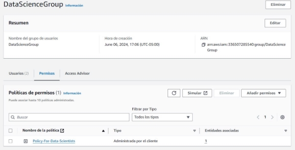

Para ver más de cerca los detalles de la política de IAM, elija {} JSON. En el archivo de política JSON, puede ver las acciones permitidas y denegadas, incluidos los recursos en los que los usuarios pueden realizar acciones.

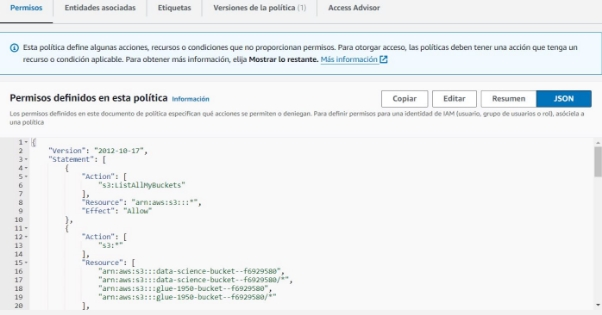

**Tarea 5: Confirmar que Mary puede acceder y utilizar el rastreador de AWS Glue**

Recupere las credenciales del usuario mary IAM y guárdelas como variables bash.

- Copie el valor de MarysAccessKey a su portapapeles.
- Copie el valor de MarysSecretAccessKey en su portapapeles.

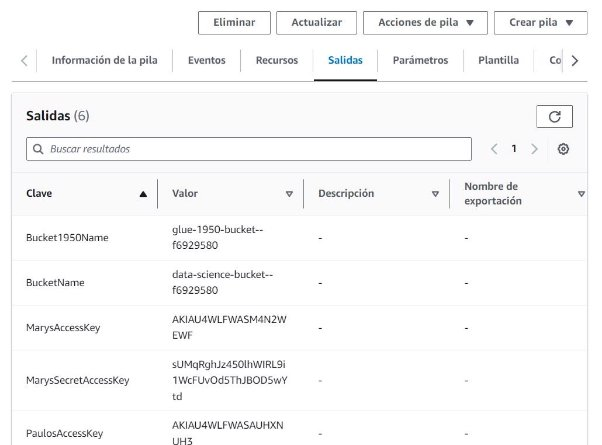

Regrese a la terminal AWS Cloud9.

- Para crear una variable para la clave de acceso, ejecute el siguiente comando. Reemplace <ACCESS-KEY> con el valor de su portapapeles. **AK=<ACCESS-KEY>**
- Para crear una variable para la clave de acceso secreta, ejecute el siguiente comando. Reemplace <SECRET-ACCESS-KEY> con el valor de su portapapeles SAK=<SECRET-ACCESS-KEY>

Pruebe el acceso de Mary al rastreador de AWS Glue.

Para probar si el usuario mary puede ejecutar el comando list-crawlers, ejecute el siguiente comando:

Para probar si el usuario mary puede ejecutar el comando get-crawler, ejecute el siguiente comando:

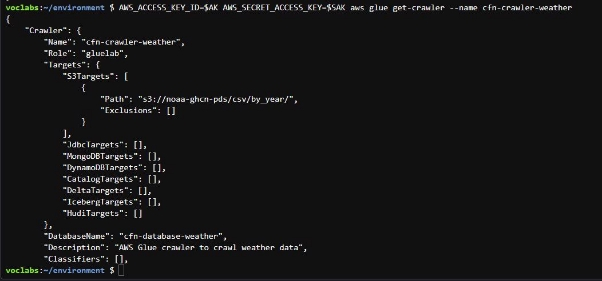

Pruebe que el usuario mary pueda ejecutar el rastreador.

Ejecute el siguiente comando.

**AWS\_ACCESS\_KEY\_ID=$AK AWS\_SECRET\_ACCESS\_KEY=$SAK aws glue start-crawler --name cfn-crawler-weather**

Para observar cómo el rastreador se ejecuta y agrega datos a la tabla, navegue hasta la consola de AWS Glue.

En el panel de navegación, elija Crawlers.

Aquí puede ver información de estado del rastreador, como se muestra en la siguiente captura de pantalla.

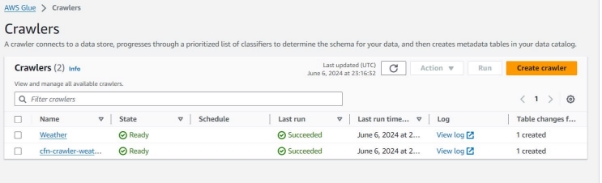

Para confirmar que el rastreador ha terminado de ejecutarse, ejecute el siguiente comando. El resultado es similar al siguiente:

