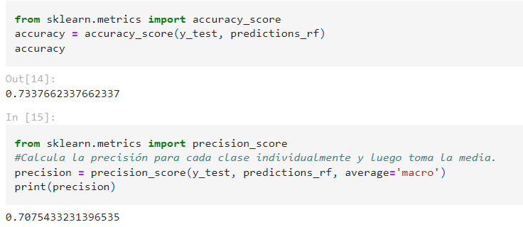
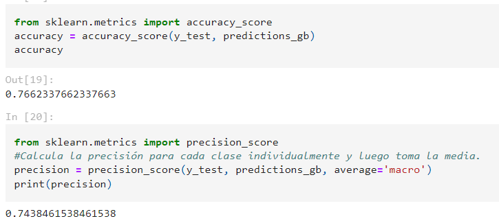
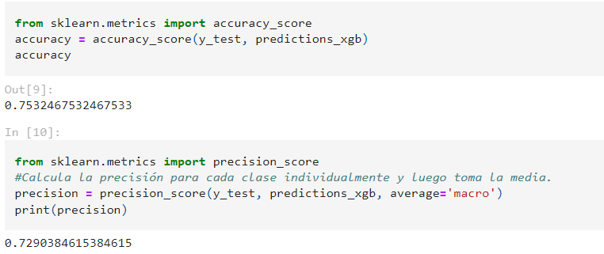
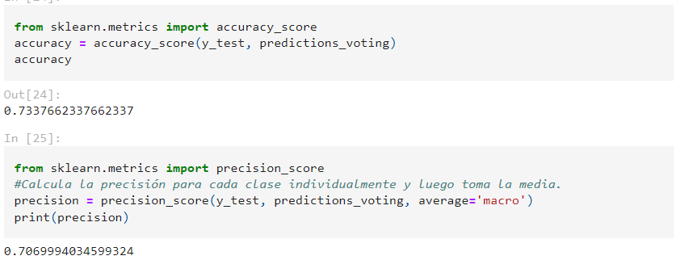
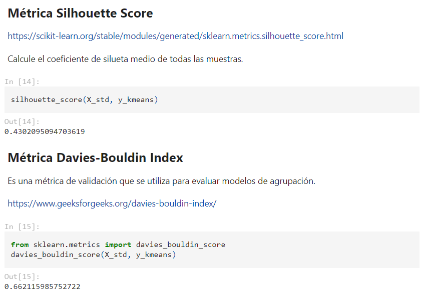
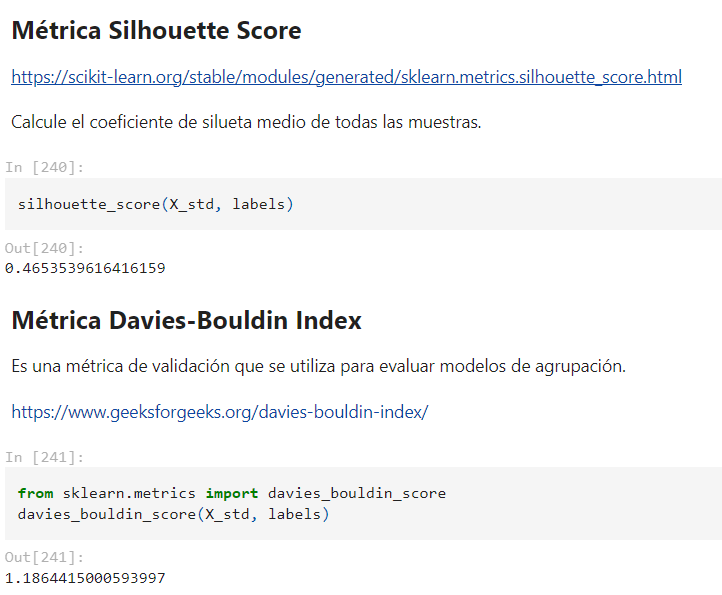
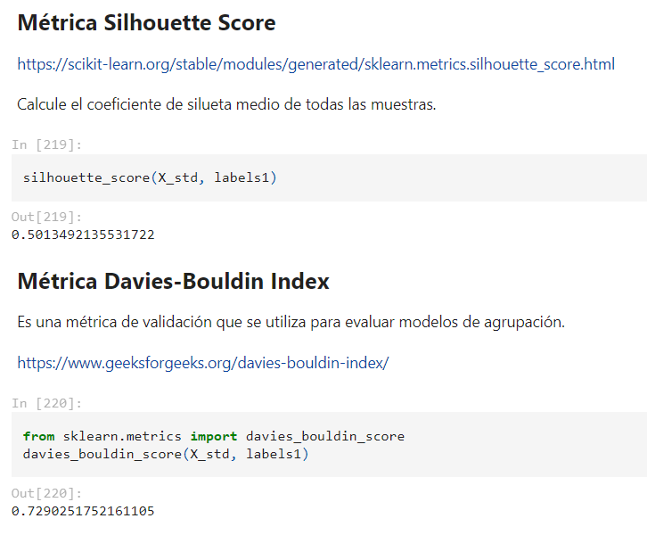

# **Informe de proyecto de Implementación de algoritmos de machine learning distribuidos**

### **Objetivo del Proyecto**

El objetivo de este proyecto es desarrollar e implementar algoritmos de machine learning distribuidos utilizando técnicas de paralelismo y herramientas como Dask y PySpark, optimizando su rendimiento y escalabilidad.

## **Sprint 1: Desarrollo de un conjunto de algoritmos de Machine Learning Objetivos:**

- Desarrollar un conjunto de algoritmos de machine learning que incluyan enfoques de ensamblado, visión computacional y clustering.
- Preparar conjuntos de datos adecuados para el entrenamiento y evaluación de los algoritmos.

  #### **Metodología**

  **Herramientas y Técnicas Utilizadas**

- **Librerías:** PyTorch, Scikit-learn, numpy , pandas y matplotlib.
- **Métricas de Evaluación:** Accuracy, Silhouette Score, Davies-Bouldin Index, precision\_score.
*Se recomienda descargar las siguientes librerías mencionadas anteriormente*
```
pip install scikit-learn
pip install torch
pip install torchvision
pip install pandas
pip install numpy
pip install matplotlib 
```
**Descripción de los Algoritmos Desarrollados**

- **Ensamblado:** Random Forest, Gradient Boosting, XGBoost y VotingClassifier.
- **Visión Computacional:** Modelos de CNN( redes neuronales convolucionales)
- **Clustering:** K-means, DBSCAN, Agglomerative Clustering

**Selección y Preparación de Datos**

### **Descripción de los Conjuntos de Datos**

- **Visión Computacional:** Conjunto de imágenes (gatos y perros)

  Este conjunto de datos abarca una colección de imágenes seleccionadas específicamente con el fin de clasificar entre perros y gatos. Con un total de 25000 imágenes únicas**.** Esta data está compuesta por un archivo .csv donde contiene las etiquetas y una carpeta donde tiene todas las imagenes.

https://www.kaggle.com/datasets/ashfakyeafi/cat-dog-images-for-classification?select

  =cat\_dog.csv

- **Clustering:** Datos tabulares (Datos nutricionales del menú de Burger King)

  Este conjunto de datos es una recopilación completa de información nutricional de los principales elementos del menú que ofrece Burger King. El conjunto de datos incluye información sobre la cantidad de calorías, grasas totales, grasas saturadas, grasas trans, colesterol, sodio, carbohidratos totales y proteínas que se encuentran en cada elemento del menú.

 <https://www.kaggle.com/datasets/mattop/burger-king-menu-nutrition-data/data>

- **Ensamblado:** Datos tabulares (Conjunto de datos sobre diabetes\*\*

  Este conjunto de datos proviene del Instituto Nacional de Diabetes y

  Enfermedades Digestivas y Renales. El objetivo del conjunto de datos es predecir de forma diagnóstica si un paciente tiene diabetes,basándose en ciertas mediciones de diagnóstico incluidas en el conjunto de datos.

  En particular, todos los pacientes aquí son mujeres de al menos 21 años de edad de ascendencia india

  **Información sobre los atributos del conjunto de datos** -

  Embarazos: Para expresar el Número de embarazos

  Glucosa: Para expresar el nivel de glucosa en sangre.

  BloodPressure: Para expresar la medición de la presión arterial.

  SkinThickness: Para expresar el grosor de la piel.

  Insulina: Para expresar el nivel de insulina en sangre.

  IMC: Para expresar el índice de masa corporal.

  DiabetesPedigreeFunción: Expresar el porcentaje de Diabetes.

  Edad: Para expresar la edad.

  Resultado: Para expresar el resultado final 1 es Sí y 0 es No

   https://www.kaggle.com/datasets/akshaydattatraykhare/diabetes-dataset

### **Proceso de Preprocesamiento de Datos**

- **Normalización:** Escalar los datos de tal manera que tengan una media de 0 y una desviación estándar de 1. Para ello, se utilizó **StandardScaler** de la librería sklearn.preprocessing.
- **Eliminación de Valores Nulos:** Tratamiento de datos faltantes. Se utilizó los métodos **isnull().sum()** lo cual ayuda a detectar si hay valores nulos en la data.
- **Transformaciones Específicas:** Conversión de formatos y preparación adecuada para los modelos.
  
## 1. **Desarrollo de Algoritmos de Ensamblado**

Se utilizó un conjunto de datos sobre la diabetes donde se predice si tiene diabetes sabiendo su nivel de glucosa, índice de masa corporal y edad.

Para ello, se utilizó los siguientes algoritmos:

#### **Random Forest:** 
Este algoritmo se basa en la construcción de múltiples árboles de decisión para tareas de clasificación con el uso del voto mayoritario (para clasificación) de los árboles individuales para hacer predicciones. Además, este algoritmo se destaca por manejo de datos complejos y proporcionando predicciones sólidas.

- **Implementación:** Usando Scikit-learn y el algoritmo de RandomForestClassifier
- **Parametros:** Se utilizaron los parametros de:
  - n_estimators=100: Número de árboles en el bosque.
  - random_state=42 : Se utiliza comunmente para obtener simpre la misma salida o resultado.
- **Resultados y Evaluación:**
  - Accuracy: Es la proporción de predicciones que el modelo clasificó correctamente.
    ```
    Accuracy = (número de predicciones correctas)/(total de número de predicciones)
    Que se halla de la siguiente manera:
    Accuracy =(TP + TN)/(TP+TN + FP + FN)
    Verdadero Positivo (TP): Resultado en el que el modelo predice correctamente la clase de que no tiene diabetes.
    Verdadero Negativo (TN): Resultado donde el modelo predice correctamente la clase de que si tiene diabetes.
    Falso Positivo (FP): Resultado donde el modelo predice incorrectamente la clase de que no tiene diabetes cuando en realidad si lo tiene.
    Falso Negativo (FN): Resultado en el que el modelo predice incorrectamente la clase si tiene diabetes cuando en realidad no tiene diabetes.
  
    ```
    En este entrenamiento se obtuvo el 73.37%.
    Para ello, calculamos las predicciones correctas y la dividimos entre el total de predicciones
    Accuracy= 113/156=0.7337
    
  - Precisión: 
    Para hallar la precisión que es la proporción de identificaciones positivas fue realmente correcta.
    Se halla con la siguiente formula:
    ```
    Presición= TP /(TP + FP)
    ```
    En este entrenamiento se obtuvo el 70.7%
    Para ello calculamos el número la predicciones de la clase que no tine diabetes y el número de predicciones incorrecta que clasificaron la clase que no tien diabetes cuando realmente tiene.
    Presición 1 (no tiene diabetes)  = 29 /29 + 16 =0.644
    Presición 2 (si tiene diabetes)  = 84 /84 + 25 =0.77
    Para halla la presicción total es= (Presición 1+Presición 2)/2=0.707
    


#### **Gradient Boosting**

- **Implementación:** Usando Scikit-learn y el algoritmo de GradientBoostingClassifier
- **Resultados y Evaluación:** Accuracy: 76.6%, Precisión: 74.3
  


#### **XGBoost**

- **Implementación:** Usando librería de XGBoost
- **Resultados y Evaluación:** Accuracy: 75.32%, Precisión: 73.04%
  


**VotingClassifier:** Para combinar múltiples modelos para mejorar la precisión y la robustez de las predicciones (https://inteligencia-artificial.dev/ensemble-learning-python/).

- **Implementación:** Usando Scikit-learn y VotingClassifier.
- **Resultados y Evaluación:** Accuracy: 74.67 %, Precisión: 72.32%
  
  

### 2. **Desarrollo de Algoritmo de Visión Computacional**

Para el desarrollo de este algoritmo se seleccionó la data de gatos y perros con un total de 25000 imágenes. Además, se entrenó una red neuronal convolucional(CNN). Para ello, se tomó referencia de la pagina web de PyTorch (https://pytorch.org/tutorials/beginner/blitz/cifar10\_tutorial.html)

#### **Modelos de CNN**

- **Implementación:** Usando PyTorch, las librerías de torch y torchvision, pandas y os
- **Metodología:**

  Primero se analizó los datos como la verificación si hay datos nulos, duplicados y cuantos datos contiene. Además, se hizo una gráfica para entender mejor la distribución de las etiquetas. Donde 0 representa gato y 1 representa perro.

  Después, de haber analizado los datos se realizó el entrenamiento de la red neuronal convolucional, para ello, primero se utilizó un transformador para cambiar las imágenes tamaño de 224x224, luego las convierte en tensores y las normaliza.

  Luego de hacer la transformación se realiza la separación de los datos en datos de entrenamiento y prueba. Para ello, definimos que el 80% de las imágenes serán para entrenamiento mientras que el 20 % será para prueba. Asimismo, definimos los conjuntos de datos de entrenamiento y de prueba.

  Seguidamente, se define la CNN con sus respectivas capas de convolución, agrupación y lineales completamente conectadas.

  **Capas lineales completamente conectadas**: El tamaño de entrada se calcula como: (tamaño de entrada de la imagen - tamaño del kernel + 1) / paso

- Para la primera capa convolucional: (224 - 5 + 1) / 1 = 220
- Para la capa de agrupación: (220 - 2) / 2 = 109
- Para la segunda capa convolucional: (109 - 5 + 1) / 1 = 105
- Para la segunda capa de agrupación: (105 - 2) / 2 = 52

A continuación, definimos la función de pérdida (CrossEntropyLoss) y el optimizador (SGD), luego, asigna automáticamente el dispositivo de cálculo adecuado (GPU si está disponible, de lo contrario, CPU). Posteriormente, se realiza el entrenamiento en 2 épocas intera cada 2000 mini-lotes e imprime la pérdida acumulada.

Por último, se guarda el modelo y se obtienen las predicciones de las imágenes de test.

- **Resultados y Evaluación:**
- Precisión de la red en las 5000 imágenes de prueba: 71 %
- Precisión para la clase: cat es 82.8 %
- Precisión para la clase: dog es 60.6 %
  


### 3. **Desarrollo de Algoritmos de Clustering**

Para el desarrollo de los algoritmos se utilizó Datos nutricionales del menú de Burger King. Donde se seleccionaron las columnas de Grasas totales y total de carbohidratos.

Para ello, se realizó la búsqueda de valores nulos en la data, la descripción de los datos así como la media y la desviación estándar. Luego, se seleccionaron las columnas mencionadas y se normalizaron los datos para después pasarlo al entrenamiento con los siguientes algoritmos:

#### **K-means:** En este algoritmo se asignó dos clusters y se seleccionaron los centroides iniciales de forma aleatoria.

- **Implementación:** Usando Scikit-learn : from sklearn.cluster import KMeans, importamos la librería de matplotlib.pyplot as plt ( para ver la gráfica de los clusters) . Para evaluar la calidad de los clusters se utilizaron las siguientes métricas: **Silhouette Score:** Sirve para evaluar la cohesión y la separación de los clusters en un conjunto de datos

  **Davies-Bouldin Index:**comparar la dispersión dentro de cada clúster con la distancia entre los centroides de los clústeres.

- **Resultados y Evaluación:**
- Silhouette Score: 0.529 → Es un valor cercano a 1 lo que indica que el punto de datos está bien dentro de su propio clúster y lejos de otros clústeres.
- Davies-Bouldin Index: 0.68 → Es menos que 1 indica una mejor partición.
  
  

#### **DBSCAN**

- **Implementación:** Usando Scikit-learn: from sklearn.cluster import DBSCAN, importamos la librería de matplotlib.pyplot as plt ( para ver la gráfica de los clusters) .

  Para evaluar la calidad de los clusters se utilizaron las siguientes métricas: Silhouette Score y Davies-Bouldin Index.

- **Resultados y Evaluación:**
- Silhouette Score: 0.46 → Es un valor cercano a 1 lo que indica que el punto de datos está bien dentro de su propio clúster y lejos de otros clústeres.
- Davies-Bouldin Index: 1.18 → Los clústeres están más dispersos y menos definidos

  

#### **Agglomerative Clustering**

- **Implementación:** Usando Scikit-learn: from sklearn.cluster import AgglomerativeClustering, importamos la librería de matplotlib.pyplot as plt ( para ver la gráfica de los clusters) .

  Para evaluar la calidad de los clusters se utilizaron las siguientes métricas: Silhouette Score y Davies-Bouldin Index.

- **Resultados y Evaluación:**
- Silhouette Score: 0.501 → Es un valor cercano a 1 lo que indica que el punto de datos está bien dentro de su propio clúster y lejos de otros clústeres.
- Davies-Bouldin Index: 0.729 → Los clústeres están más dispersos y menos definidos.

  


### **Análisis y evaluación**

### **Comparación con los objetivos del Sprint**

- **Objetivos alcanzados:** Se implementaron y evaluaron modelos y se documentaron los resultados. Además, estan listos para ser usados los datos.
- **Objetivos no alcanzados:** Todos los objetivos planificados fueron alcanzados.

### **Plan para el próximo Sprint**

#### **Objetivos del próximo Sprint**

- Implementar técnicas de paralelismo y distribución para los algoritmos de machine learning desarrollados.
- Utilizar Dask y PySpark para manejar grandes volúmenes de datos y mejorar la escalabilidad de los algoritmos.

#### **Tareas planificadas**

- Configuración de Dask y PySpark
- Implementación de paralelismo con Dask
- Implementación de paralelismo con PySpark
- Evaluación de la eficiencia
