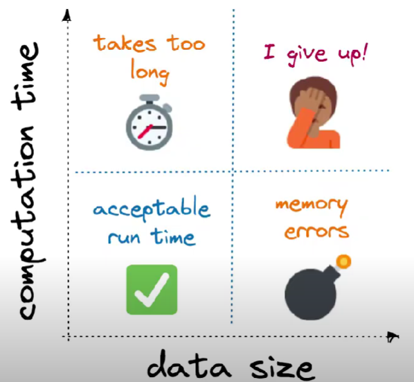
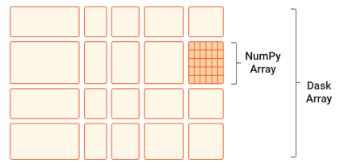
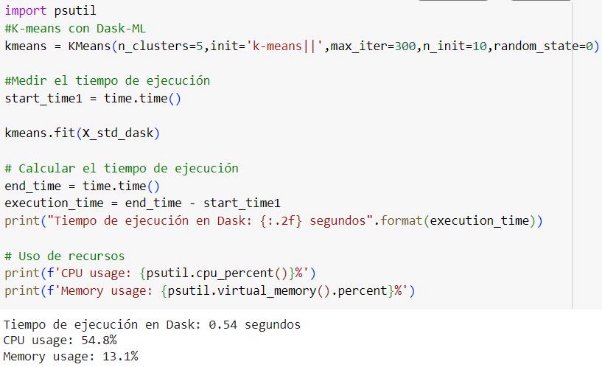
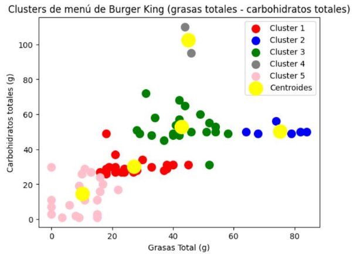
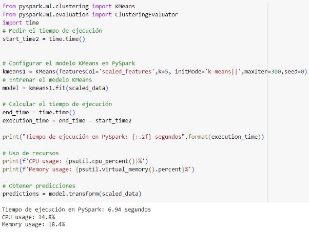
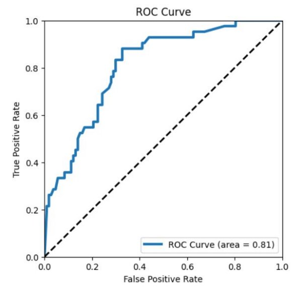
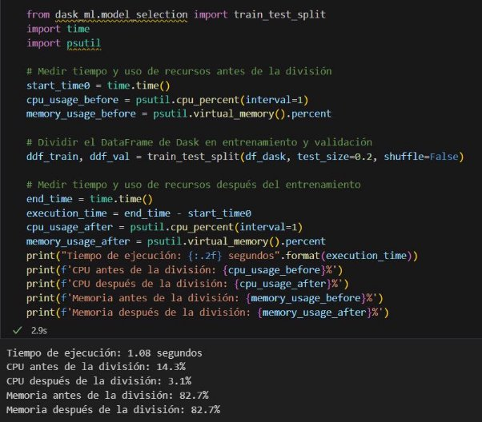
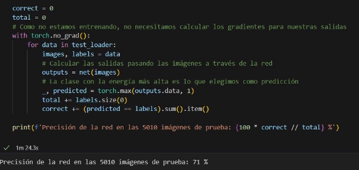

# **Reporte del Sprint 2**

## 1. **Introducción**

Después de haber esquematizado los algoritmos de machine learning que se realizó en el anterior sprint, lo que se plantea en este Sprint aplicar técnicas de  paralelismo y distribución a dichos algoritmos con el objetivo de manejar grandes volúmenes de datos y mejorar la escalabilidad de los algoritmos. Para ello, se hará uso de Dask y PySpark.

**¿Por qué se va a paralelizar?**
*Proque tanto NumPy, pandas y Scikit-learn estan limitadas ejecutar sus cálculos en un solo núcleo, pero Dask y PySpark solucionan esto, ya que realizan los calculos en paralelo utilizando multiples núcleos y también distribuidos en multiples máquinas lo que hacen que estas bibliotecas sean más rapidas y escalables.*

**Desafíos de escalar al realizar Machine Learning**



*En el eje **x** tenemos el tamaño de los datos y en el eje **y** tenemos tiempo de cálculo o complejidad del modelo.*

**PROBLEMA 1:** El primer problema es un problema vinculado a la memoria cuando sus conjuntos de datos crecen más que la RAM (que se muestra a lo largo del eje vertical de la derecha). Ante este desafío de escala, incluso cargar los datos en NumPy o pandas se vuelve imposible.

**PROBLEMA 2:** El segundo problema es un problema vinculado a la CPU, los datos caben en la RAM, pero tu entrenamiento o tu optimización de hiperparámetros está tardando demasiado (que se muestra a lo largo del eje horizontal de arriba).

*En ambos problemas podría beneficiarse del uso del paralelismo.*

[Más información](https://ml.dask.org/) 

### **Dask**
Dask es una biblioteca de Python que facilita la programación paralela y distribuida. Te permite paralelizar el código de manera eficiente, y es especialmente útil para el procesamiento de grandes conjuntos de datos y cálculos complejos. Además, su integración con NumPy, pandas y Scikit-learn lo hacen especialmente útil para la ciencia de datos y el análisis de datos a gran escala.


**Uso de Dask en Programación Paralela:** Dask permite la ejecución en paralelo dividiendo las tareas en bloques y ejecutándolas simultáneamente en múltiples núcleos del mismo equipo. 

**Uso de Dask en Programación Distribuida:**
Dask también permite la programación distribuida ejecutando tareas en un clúster de múltiples máquinas. Para ello, se hace uso de cluster en ves de usar una máquina local.


### **PySpark**
PySpark es la API de Python para Apache Spark. Le permite realizar procesamiento de datos a gran escala en tiempo real en un entorno distribuido utilizando Python. Su objetivo es hacer que el aprendizaje automático práctico sea escalable y sencillo. 


## 2. **Planificación**

### **Tareas planificadas**

- Implementación con Dask:
  - Configuración del entorno.
  - Implementación de un algoritmo de clustering, visión computacional y ensamblado.
  - Entrenamiento y evaluación del modelo.
- Implementación con PySpark:
  - Configuración del entorno.
  - Implementación de un algoritmo de clustering, visión computacional y ensamblado.
  - Entrenamiento y evaluación del modelo.
- Evaluación comparativa:
  - Comparar el rendimiento de los algoritmos en un entorno distribuido frente a un entorno no distribuido.
  - Evaluar el tiempo de entrenamiento, la utilización de recursos y la escalabilidad de los algoritmos.
  - Análisis de resultados.
- Documentación:
- Redacción del informe sobre la implementación y los resultados.
- Preparación de gráficos y tablas de resultados.

### **Cronograma**


|**Tarea**|**Fecha de inicio**|**Fecha de fin**|**Hitos importantes**|
| - | :-: | :-: | - |
|Configuración del entorno|14/06/2024|15/06/2024|Ambiente de desarrollo listo|
|Implementación con Dask|16/06/2024|22/06/2024|Modelos entrenados|
|Implementación con PySpark|16/06/2024|22/06/2024|Modelos entrenado|
|Evaluación comparativa|21/06/2024|22/06/2024|Resultados preliminares|
|Documentación|20/06/2024|22/06/2024|Informe finalizado|

## 3. **Implementación**

### **Descripción del trabajo realizado**

- Configuración del entorno: Se configuraron los entornos de desarrollo tanto para Dask como para PySpark en un clúster distribuido.
- Implementación con Dask: Se desarrolló para un algoritmo de clustering, visión computacional y ensamblado. Utilizando Dask para la manipulación de datos y el entrenamiento del modelo. Se aplicó la métrica de accuracy para medir la precisión del modelo y curva ROC.
- Implementación con PySpark: Se desarrolló para un algoritmo de clustering, visión computacional y ensamblado. Utilizando PySpark para la manipulación de datos y el entrenamiento del modelo. Se aplicó la métrica de accuracy para medir la precisión del modelo.
- Evaluación comparativa: Se utilizó las librerías **time** y **psutil**, para evaluar el tiempo y uso de recursos (antes y después) de la división de los datos en train y test, asimismo, para entrenamiento.

#### **Algoritmos y métodos**

- **Dask:**
- **Algoritmo:** Algoritmo de clustering (K-means).
- Diagrama de pasos:


##### **Aplicación de paralelización con dask**

Se aplicó paralelización para el manejo de los datos a través de 
**X_std_dask = da.from_array(X_std,chunks=(1000,2))** que permite convertir a Dask array.
Dask array es una implementación paralela de Numpy que nos permite dividir en muchas matrices más pequeñas en los datos que le estamos dando que son los datos estandarizado X_std. Además, cada uno de estas matrices es una matriz de Numpy. Como se ilustra en la Figura1.



Figura1:*Dask array implementación paralela de Numpy*

Estos fragmentos de matrices que se obtine a través de Dask array permite escalar cuando el conjunto de datos crece. En lo que para Numpy es difícil cargar estos datos porque solo trabaja en un solo núcleo, mientras con Dask array permite utilizar todos los núcleos locales que se tiene en una maquina local.

Además, se utilizo la librería de **dask_ml.cluster** importando la biblioteca KMeans. Dask-ML permite que un algoritmo de aprendizaje automático se escalable. Ya que, al encontrase con desafíos al momento de escalar un modelo y que este se vuelve grande o complejo va afectar el flujo de trabajo presentado demoras al instante que se desea hacer el entrenamiento, predicción o evaluación.

Existe diferentes maneras de paralelizar unas de las formas es utilizando el backend de Joblib de Dask para paralelizar Scikit-Learn directamente o utilizando algunos estimadores dask-ml  como **dask_ml.cluster.KMeans**.

En este caso se utilizó el estimador **dask_ml.cluster.KMeans* que nos va a permitir paralelizar al momento de realizar el entrenamiento del algoritmo de K-means. En el codigo tenemos la siguiente línea:
```
#K-means con Dask-ML
kmeans = KMeans(n_clusters=5,init='k-means||',max_iter=300,n_init=10,random_state=0)
```
En **dask_ml.cluster.KMeans* se inicializa predeterminadamente con el parametro de *k-means||* em comparación de scikit-learn que es *k-means++*. El parametro *k-means||* esta diseñado para un estorno distribuido y es una variante de *k-means++* que esta diseñada para funcionar de forma paralela en cambio *k-means++* es secuencial. Pero en la aplicación de este parametro *k-means||* tiene una implicación cuando el conjunto de dato cabe en la memoria en una sola máquina este puede ser más lenta que la de scikit-learn *k-means++*.
Como se ve a continuación:

- **Algoritmo:** Algoritmo de ensamblado  (XGBoost).
- Diagrama de pasos:


- **Algoritmo:** Algoritmo de visión computacional (CNN).
- Diagrama de pasos:

  

- **PySpark:**
- **Algoritmo:** Algoritmo de clustering (K-means).
- Diagrama de pasos:

  

- **Algoritmo:** Algoritmo de ensamblado  (XGBoost).
- Diagrama de pasos:

  

#### **Desafíos encontrados**

- **Dask:** 
- Problemas de compatibilidad con ciertas versiones de bibliotecas. Se resuelve actualizando a versiones compatibles se logra  instalando dask\_xgboots y xgboots, pero luego requieren reiniciar la ejecución, va a seguir ese mensaje.Sin embargo, correrá el programa.


- Limitaciones en la API de Dask para algoritmos de machine learning más allá de K-means, lo que restringe algunos algoritmos.
- **PySpark:** Limitaciones en la API de PySpark para  algunos algoritmos de machine learning, lo que restringe la implementación de dichos algoritmos.
## 4. **Resultados**

### **Funcionalidades desarrolladas**

- Modelos de K-means, XGBoost  implementados y entrenados con Dask y PySpark. Además, en el modelo de CNN se aplicó Dask para la paralelización de los datos.
- Se utilizaron las librerías **time** y **psutil**, para evaluar el tiempo y uso de recursos.
- Además, se midió la precisión de los algoritmos. 

### **Pruebas realizadas**

- Medición de tiempo de ejecución: Para ello, se hizo uso la librería de time.
- Evaluar la utilización de recursos: Verificación del uso de los recursos con el uso de la librería psutil.. 
- Pruebas de rendimiento: Evaluación de la escalabilidad y eficiencia de los modelos.
- Evaluación del modelo con la métrica Accuracy, Silhouette Score y Davies-Bouldin Index.

### **Demostración de funcionalidades** 

#### **Captura de pantalla de la evaluación del modelo de rendimiento y de utilización de recursos con Dask (K-means)**



#### **Evaluación del modelo con la métrica Silhouette Score y Davies-Bouldin Index  (K-means)**


#### **Comentarios de los resultados:**

Al paralelizar la tarea de entrenamiento con Dask, se obtuvo un tiempo de ejecución de 0.54 segundos, con un uso de CPU del 54.8% y un uso de memoria del 13.1%. En cuanto a las métricas de evaluación:

**Silhouette Score** de 0.42: Esto indica que los clústeres están ligeramente separados entre sí, sugiriendo una calidad de clúster moderada.

**Índice de Davies-Bouldin** de 0.65: Este valor sugiere que los nodos dentro de cada clúster están relativamente bien separados, y los clústeres en general son compactos y distintos. Estas métricas reflejan que el modelo tiene una separación de clústeres razonable y que los clústeres son relativamente compactos, lo cual es un buen indicio de que el algoritmo de clustering ha funcionado de manera adecuada en el entorno paralelo proporcionado por Dask.



#### **Captura de pantalla de la evaluación del modelo con PySpark (K-means)**



#### **Evaluación del modelo con la métrica Silhouette Score (K-means)**


#### **Comentarios de los resultados:**

Al paralelizar la tarea de entrenamiento con Pyspark, se obtuvo un tiempo de ejecución de 6.94 segundos, con un uso de CPU del 14.8% y un uso de memoria del 18.4%. En cuanto a las métricas de evaluación:

**Silhouette Score** de 0.53: Esto indica que los clústeres están ligeramente separados entre sí, sugiriendo una calidad de clúster moderada.

#### **Captura de pantalla de la evaluación del modelo de rendimiento y de utilización de recursos con Dask (XGBoost)**


**Métrica:**


#### **Comentarios de los resultados:**

Al paralelizar la tarea de entrenamiento con Pyspark, se obtuvo un tiempo de ejecución de 4.92 segundos, con un uso de CPU del 100% y un uso de memoria del 13%. En cuanto a las métricas de evaluación:

#### **Gráfica de Curva ROC:**



**Accuracy:** El valor es  de 74.5%: Esto indica que el modelo está prediciendo bien. 

#### **Captura de pantalla de la evaluación del modelo de rendimiento y de utilización de recursos con Pspark (XGBoost)**


**Métrica:**


**Comentarios de los resultados:**

Al paralelizar la tarea de entrenamiento con Pyspark, se obtuvo un tiempo de ejecución de 20.43 segundos, con un uso de CPU del 95.5% y un uso de memoria del 18.0%. En cuanto a las métricas de evaluación:

**Accuracy:** El valor es  de 1: Esto indica que el modelo está prediciendo correctamente. 

#### **Captura de pantalla de la evaluación del modelo de rendimiento y de utilización de recursos con Dask (CNN - En la división de datos de train y test)**



**Comentarios de los resultados:**

Al paralelizar la tarea de entrenamiento con Pyspark, se obtuvo un tiempo de ejecución de 1.08 segundos, con un uso de CPU  después de dividir los datos del 3.1% y un uso de memoria del 82.7%. En cuanto a las métricas de evaluación:



**Accuracy:** El valor es  de 71%: Esto indica que el modelo está prediciendo correctamente. 

#### **Comparación:**

**Ejecución de CNN con un entorno no distribuido**


#### **Análisis Comparativo**

- **Tiempo de Ejecución**
- **Entorno No Distribuido:** 1.04 segundos.
- **Entorno Distribuido:** 1.08 segundos.
- **Conclusión:** El tiempo de ejecución es ligeramente mayor en el entorno distribuido. Esto puede deberse a la sobrecarga de comunicación entre los nodos en el entorno distribuido.

#### **Ejecución de XGBoost con un entorno no distribuido**


#### **Ejecución de K-means con un entorno no distribuido**


**Comentario:** Estos resultados reflejan que, aunque el entorno distribuido puede tener una ligera sobrecarga en términos de tiempo de ejecución debido a la coordinación entre nodos, ofrece ventajas significativas en términos de eficiencia en el uso de CPU y memoria. Esto es especialmente importante cuando se manejan grandes volúmenes de datos, donde la capacidad de distribuir la carga de trabajo puede reducir la presión sobre los recursos individuales y mejorar el rendimiento general del sistema.

**Ventajas de escalabilidad en entornos distribuidos**: El entorno distribuido mostró ser ligeramente más lento en términos de tiempo de ejecución para este tamaño específico de dataset debido a la sobrecarga de comunicación. Sin embargo, la eficiencia en el uso de CPU y memoria sugiere que el sistema puede manejar un aumento significativo en la carga de trabajo simplemente añadiendo más nodos al clúster.

**Limitaciones de escalabilidad en entornos no distribuidos**: El entorno no distribuido mostró ser eficiente para conjuntos de datos moderados. Sin embargo, al acercarse a los límites físicos del hardware, la eficiencia disminuye y el sistema puede volverse ineficaz o incluso fallar en manejar datasets más grandes.

## 5. **Análisis y evaluación**

### **Comparación con los objetivos del Sprint**

- **Objetivos alcanzados:** Se implementaron y evaluaron modelos con Dask y PySpark, y se documentaron los resultados.
- **Objetivos no alcanzados:** Todos los objetivos planificados fueron alcanzados.

#### **Lecciones aprendidas**

- **Qué funcionó bien:** La integración de Dask y PySpark en el entorno distribuido.
- **Qué se podría mejorar:** Optimización de la memoria en entornos distribuidos. Optimizar los algoritmos de machine learning para mejorar su rendimiento y eficiencia.
## 6. **Plan para el próximo Sprint**

#### **Objetivos del próximo Sprint**

- Optimizar los algoritmos de machine learning para mejorar su rendimiento y eficiencia.
- Preparar y presentar los resultados del proyecto.

#### **Tareas planificadas**

- Optimización de modelos: Ajustes de parámetros y manejo de excepciones. También, analizar el rendimiento.
- Identificar y abordar cuellos de botella en el rendimiento de los algoritmos.
- Ajustar hiperparámetros y realizar tuning de modelos para mejorar la precisión y la eficiencia.
- Preparación de la presentación.
