# **Reporte del Sprint 2**

## 1. **Introducción**

Después de haber esquematizado los algoritmos de machine learning que se realizó en el anterior sprint, lo que se plantea en este Sprint aplicar técnicas de  paralelismo y distribución a dichos algoritmos con el objetivo de manejar grandes volúmenes de datos y mejorar la escalabilidad de los algoritmos. Para ello, se hará uso de Dask y PySpark.

**¿Por qué se va a paralelizar?**
*Porque tanto NumPy, pandas y Scikit-learn estan limitadas ejecutar sus cálculos en un solo núcleo, pero Dask y PySpark solucionan esto, ya que realizan los calculos en paralelo utilizando multiples núcleos y también distribuidos en multiples máquinas lo que hacen que estas bibliotecas sean más rapidas y escalables.*

**Desafíos de escalar al realizar Machine Learning**


*En el eje **x** tenemos el tamaño de los datos y en el eje **y** tenemos tiempo de cálculo o complejidad del modelo.*

**PROBLEMA 1:** El primer problema es un problema vinculado a la memoria cuando sus conjuntos de datos crecen más que la RAM (que se muestra a lo largo del eje vertical de la derecha). Ante este desafío de escala, incluso cargar los datos en NumPy o pandas se vuelve imposible.

**PROBLEMA 2:** El segundo problema es un problema vinculado a la CPU, los datos caben en la RAM, pero tu entrenamiento o tu optimización de hiperparámetros está tardando demasiado (que se muestra a lo largo del eje horizontal de arriba).

*En ambos problemas podría beneficiarse del uso del paralelismo.*

[Más información](https://ml.dask.org/) 


[Ver Ejemplo Sklearn vs Dask](https://github.com/KimberlySalazarB/Computaci-n-paralela-y-distribuida/blob/main/Proyecto-C8286/Sprint2/notebooks/Sklearn_vs_Dask.ipynb)

### **Dask**
Dask es una biblioteca de Python que facilita la programación paralela y distribuida. Te permite paralelizar el código de manera eficiente, y es especialmente útil para el procesamiento de grandes conjuntos de datos y cálculos complejos. Además, su integración con NumPy, pandas y Scikit-learn lo hacen especialmente útil para la ciencia de datos y el análisis de datos a gran escala.


**Uso de Dask en Programación Paralela:** Dask permite la ejecución en paralelo dividiendo las tareas en bloques y ejecutándolas simultáneamente en múltiples núcleos del mismo equipo. 

**Uso de Dask en Programación Distribuida:**
Dask también permite la programación distribuida ejecutando tareas en un clúster de múltiples máquinas o núcleos de CPU. 

### **PySpark**
PySpark es la API de Python para Apache Spark. Le permite realizar procesamiento de datos a gran escala en tiempo real en un entorno distribuido utilizando Python. Su objetivo es hacer que el aprendizaje automático práctico sea escalable y sencillo. 


## 2. **Planificación**

### **Tareas planificadas**

- Implementación con Dask:
  - Configuración del entorno.
  - Implementación de un algoritmo de clustering, visión computacional y ensamblado.
  - Entrenamiento y evaluación del modelo.
- Implementación con PySpark:
  - Configuración del entorno.
  - Implementación de un algoritmo de clustering, visión computacional y ensamblado.
  - Entrenamiento y evaluación del modelo.
- Evaluación comparativa:
  - Comparar el rendimiento de los algoritmos en un entorno distribuido frente a un entorno no distribuido.
  - Evaluar el tiempo de entrenamiento, la utilización de recursos y la escalabilidad de los algoritmos.
  - Análisis de resultados.
- Documentación:
- Redacción del informe sobre la implementación y los resultados.
- Preparación de gráficos y tablas de resultados.

### **Cronograma**


|**Tarea**|**Fecha de inicio**|**Fecha de fin**|**Hitos importantes**|
| - | :-: | :-: | - |
|Configuración del entorno|14/06/2024|15/06/2024|Ambiente de desarrollo listo|
|Implementación con Dask|16/06/2024|22/06/2024|Modelos entrenados|
|Implementación con PySpark|16/06/2024|22/06/2024|Modelos entrenado|
|Evaluación comparativa|21/06/2024|22/06/2024|Resultados preliminares|
|Documentación|20/06/2024|22/06/2024|Informe finalizado|

## 3. **Implementación**

### **Descripción del trabajo realizado**

- Configuración del entorno: Se configuraron los entornos de desarrollo tanto para Dask como para PySpark en un clúster distribuido.
- Implementación con Dask: Se desarrolló para un algoritmo de clustering, visión computacional y ensamblado. Utilizando Dask para la manipulación de datos y el entrenamiento del modelo. Se aplicó la métrica de accuracy para medir la precisión del modelo y curva ROC.
- Implementación con PySpark: Se desarrolló para un algoritmo de clustering, visión computacional y ensamblado. Utilizando PySpark para la manipulación de datos y el entrenamiento del modelo. Se aplicó la métrica de accuracy para medir la precisión del modelo.
- Evaluación comparativa: Se utilizó las librerías **time** y **psutil**, para evaluar el tiempo y uso de recursos (antes y después) de la división de los datos en train y test, asimismo, para entrenamiento.

#### **Algoritmos y métodos**

- **Dask:**
- **Algoritmo:** Algoritmo de clustering (K-means).
- Diagrama de pasos:


##### **Aplicación de paralelización con dask**

Se aplicó paralelización para procesar los datos a través de 
**X_std_dask = da.from_array(X_std,chunks=(1000,2))** que permite convertir a Dask array.
Dask array es una implementación paralela de Numpy que nos permite dividir en muchas matrices más pequeñas en los datos que le estamos dando que son los datos estandarizado X_std y lo almacena en un disco y carga solo fragmentos necesarios en memoria en cada momento. Además, cada uno de estas matrices es una matriz de Numpy. Como se ilustra en la Figura1.


Figura1:*Dask array implementación paralela de Numpy*

Estos fragmentos de matrices que se obtine a través de Dask array permite escalar cuando el conjunto de datos crece. En lo que para Numpy es difícil cargar estos datos porque solo trabaja en un solo núcleo, mientras con Dask array permite utilizar todos los núcleos locales que se tiene en una maquina local permitiendo acelerar significativamente el tiempo de procesamiento.

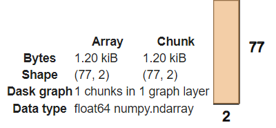

Además, se utilizo la librería de **dask_ml.cluster** importando la biblioteca KMeans. Dask-ML permite que un algoritmo de aprendizaje automático se escalable. Ya que, al encontrase con desafíos al momento de escalar un modelo y que este se vuelve grande o complejo va afectar el flujo de trabajo presentado demoras al instante que se desea hacer el entrenamiento, predicción o evaluación.

Existe diferentes maneras de paralelizar unas de las formas es utilizando el backend de Joblib de Dask para paralelizar Scikit-Learn directamente o utilizando algunos estimadores dask-ml  como **dask_ml.cluster.KMeans**.

En este caso se utilizó el estimador *dask_ml.cluster.KMeans* que nos va a permitir paralelizar al momento de realizar el entrenamiento del algoritmo de K-means. En el codigo tenemos la siguiente línea:
```
#K-means con Dask-ML
kmeans = KMeans(n_clusters=5,init='k-means||',max_iter=300,n_init=10,random_state=0)
```
En *dask_ml.cluster.KMeans* se inicializa predeterminadamente con el parametro de *k-means||* em comparación de scikit-learn que es *k-means++*. El parametro *k-means||* es una variante de *k-means++* que esta diseñada para funcionar de forma paralela que funciona bien para un entorno distribuido, en cambio *k-means++* es secuencial. Pero en la aplicación de este parametro *k-means||* tiene una implicación cuando el conjunto de dato cabe en la memoria en una sola máquina este puede ser más lenta que la de scikit-learn *k-means++*.

Como se ve a continuación:

**Paralelización con Dask-ML con la librería dask_ml.cluster.KMeans y parametro *k-means||***
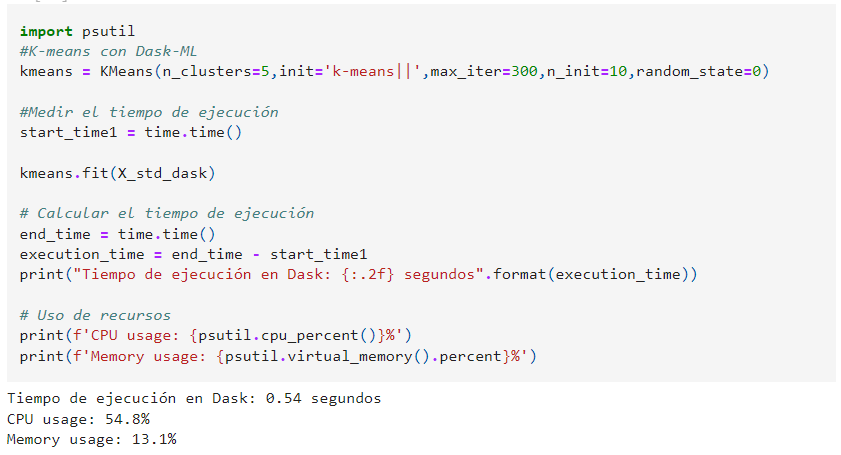

**Scikit-Learn sin paralelización con la librería sklearn.cluster.KMeans y parametro *k-means++***

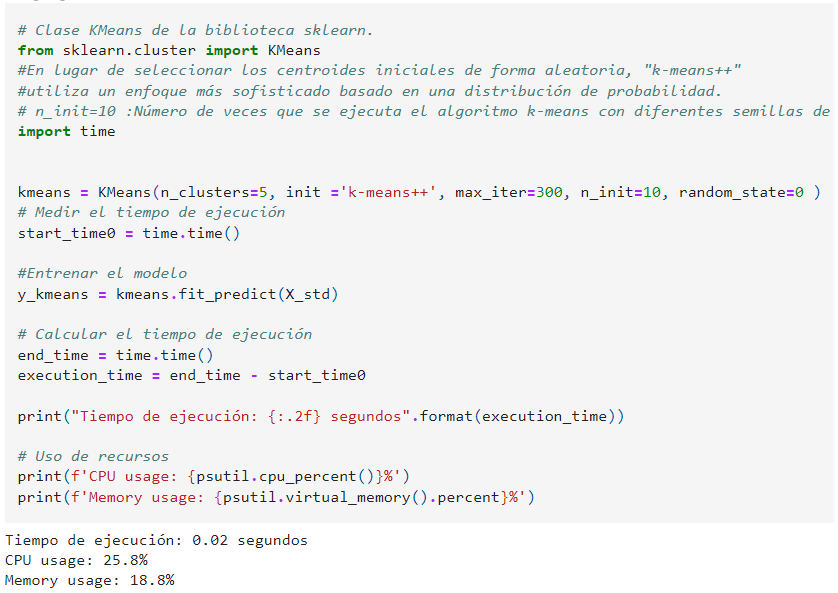

Los resultados anteriores se observa que la implementación sin paralelización es más rápida que la paralelización con Dask-ML esto se debe a que los datos caben en la memoria. Por lo cual, el resultado de la paralelización es más lenta en la Paralelización con Dask-ML.

  - *k-means||* y *k-means++* son inicializadores que permiten seleccionar los centros del cluster hasta llegar a converger es decir repetir la asignación de puntos a los clusteres según al centro más cercano a través de la de la distancia euclidiana y a la actualización de los centros de los clusteres hasta que los centros ya no cambien significativamente entre las interacciones.


 #### **Algoritmo: Algoritmo de ensamblado  (XGBoost).**
- Diagrama de pasos:


En este algoritmo se aplicó una programación distribuida para distribuir tareas a través de múltiples núcleos de CPU. Para lograr esto se hizo uso de un cliente Dask (**Client()**) la cual gestiona la ejecución distribuida, también, se configurar un clúster de Dask para ejecutar tareas paralelas. En el codigo se puede observar las siguientes líneas:
```
from dask.distributed import Client
client = Client(n_workers=4, threads_per_worker=2)
```
Esta línea nos indica que trabajarenos con 4 trabajadores y cada trabajador tendra 2 hilos esto quiere decir que cada trabajador puede manejar hasta 2 tareas simultáneamente(paralelo) dentro de su propio proceso. Asimismo, cada trabajador va ser un proceso independiente que puede ejecutar tareas de Dask. 

Después, de ello se hizo uso de *dask.dataframe* que permite procesar conjuntos de datos tabulares paralelizando pandas [Más información de dask.dataframe](https://docs.dask.org/en/latest/dataframe.html) . Dask dataframes cordina una colección de muchos dataframes de pandas que pueden estar en el disco o en otras máquinas, como se observa en la siguiente imagen:

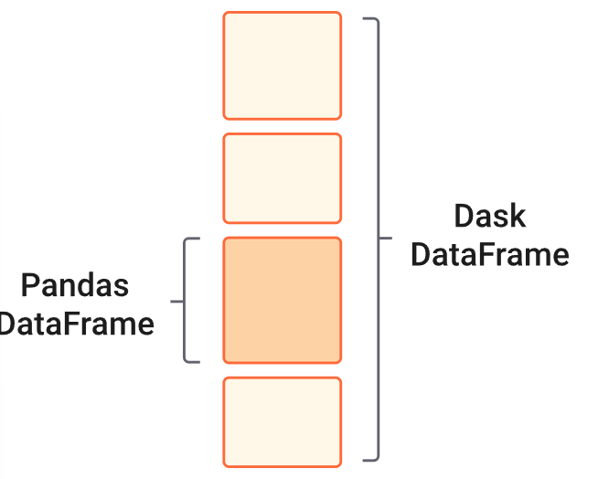

Por otra parte, se utilizó *dask_ml.model_selection* para dividir tanto los datos de entrenamiento y prueba. Para entrenar el modelo de XGBoost, utilice *dask-xgboost* que permite realizar el entrenamiento en utilizando los 4 trabajadores en paralelo sobre el conjunto de datos distribuidos en un clúster. La siguiente línea de codigo:
```
bst = dask_xgboost.train(client, params, X_train, y_train, num_boost_round=10)
```
*dask_xgboost.train* sirve para entrenar un modelo XGBoost distribuido. Aquí, *client*  previamente inicializado gestiona la distribución de tareas entre los trabajadores disponibles.

En comparación al resultado del sprint 1 de la ejecución con scikit-learn y los resultados de sprint2. Se obtuvo un mejor resultado en el sprint esto se debe que los datos caben en la memoria y por lo cual, hacer que la ejecución en una solo núcleo se ejecute más rápido que en 4 núcleos(procesos). 

**Con scikit-learn**

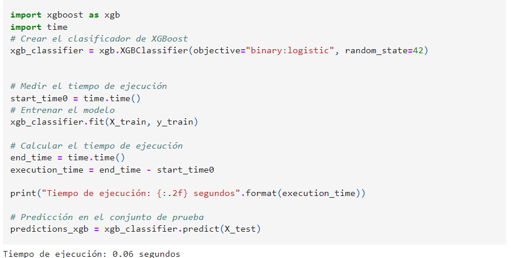

**Con Dask -> Distribuido**

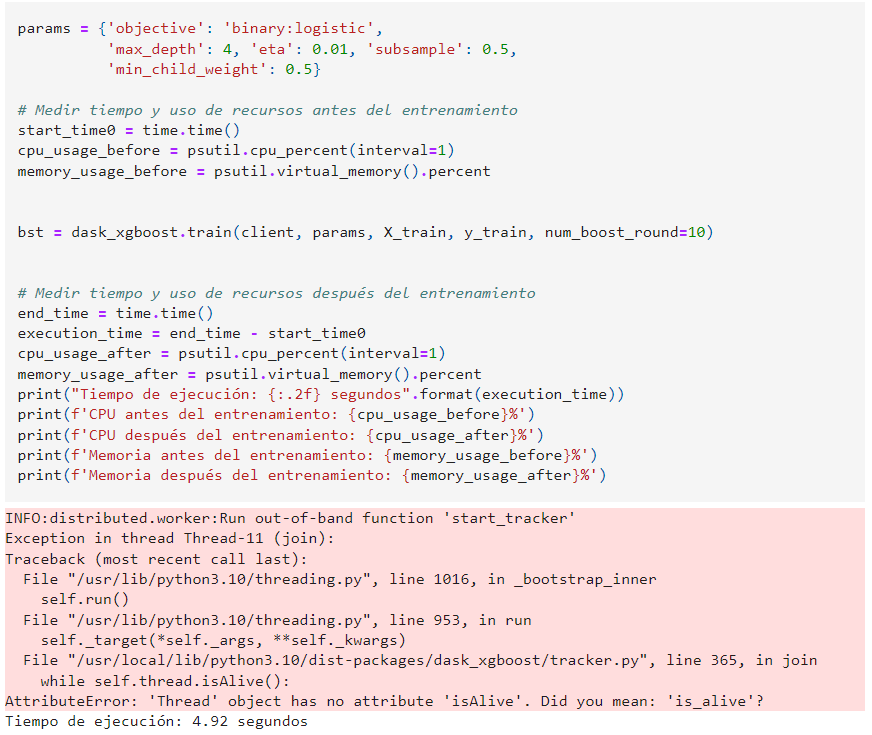

- **Algoritmo:** Algoritmo de visión computacional (CNN).
- Diagrama de pasos:

  

 En este algoritmo se aplucó paralelización y distribuida. Para la parte distribuida se configura un cliente Dask para manejar operaciones paralelas utilizando 4 trabajadores (procesos) cada uno con 2 hilos y con una limitación de memoria de cada trabajador a 2GB estos parámetros permiten optimizar el uso de recursos de la CPU y memoria. 
 Asimismo, se convierte el Dataframe de Pandas a un Dataframe de Dask que permite manejar y procesar conjuntos de datos grandes que no caben en la memoria de una sola máquina. Además, que permite manipular los datos distribuidos a través de trabajadores.

Por otra parte, se hizo uso de la librería de *dask_ml.model_selection import train_test_split*  para la división de datos. En esta parte, Dask-ML divide el Dataframe de Dask en paralelo aprovechando que el cliente Dask tiene múltiples trabajadores e hilos.

Asimimo, en la siguiente línea de codigo se hace uso de **.compute** este método de Dask se encarga de ejecutar todas las tareas pendientes en paralelo y convierte el DataFrame en un Numpy array. para luego se usadas en la parte de la creación de conjuto de datos de entrenamiento y de prueba. Además, de pasar por una transformación de los datos que en este caso se está trabajando con imagenes.

Los resultados muestran que la ejecución de la división de los datos es ligeramente más rápido en una programación no distribuida que la distribuida. Esto se debe a la cantidad de datos, ya que los datos caben en la memoría y es más rápido en una misma máquina.

**Con scikit-learn**

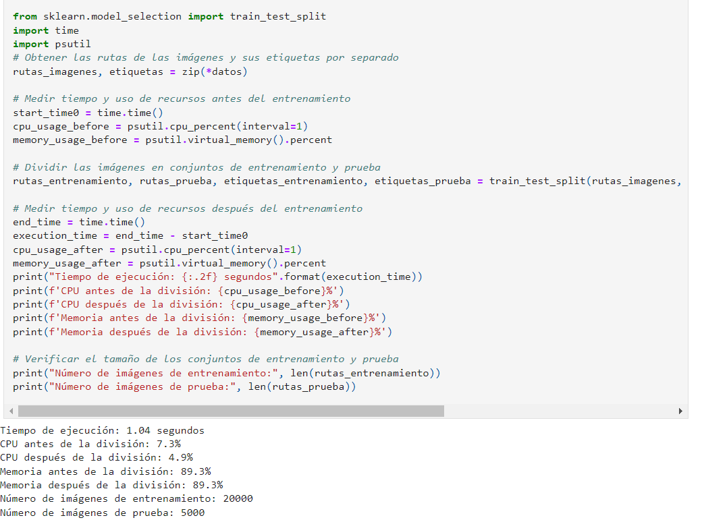

**Con Dask -> Distribuido**

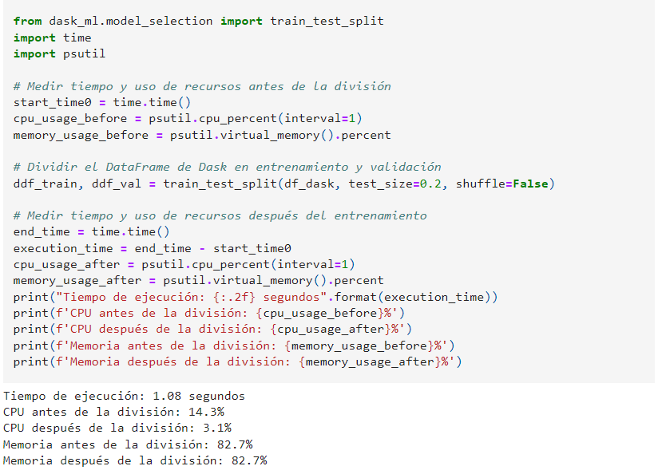

- **PySpark:**
- **Algoritmo:** Algoritmo de clustering (K-means).
- Diagrama de pasos:

  

  En este algoritmo de K-means con PySpark se crea una sesión de Spark que permite la ejecución de operaciones de Spark que están diseñadas para aprobechar la programación paralela y distribuida. También se hace uso de *spark.read.csv* para leer un archivo en un DataFrame de Spark. Este DataFrame se distribuirá automaticamente en el clúster dividiendo el archivo CSV en fragmentos que se procesarán en paralelo ustilizando múltiples núcleos en cada nodo del clúster.

En la siguientes líneas se ejecutan en paralelo donde se hace uso de VectorAssembler para convertir las columnas de características en un solo vector. Luego, se aplica esta transformación al DataFrame creando una columna con los vectores de características. 

```
vec_assembler = VectorAssembler(inputCols=['Fat (g)', 'Total Carb (g)'],
                                outputCol='Caracteristicas')
data_final = vec_assembler.transform(dataset)
```
Asimismo, la líneas que estandarizan las caracteristicas también se ejecuta en paralelo donde cada nodo procesa una partición de los datos de manera independiente. 

Por otra parte, en el momento de entrenar el algoritmo de KMeans también se ejecuta en paralelo 
en el clúster de Spark. Los datos se dividen en particiones y cada nodo procesa una parte de los datos en paralelo. Cada nodo contribuye al cálculo de los centros de los clusters, y los resultados se combinan para obtener los centroides finales.

Los resultados muestran que el algoritmo ejecutado con scikit-learn se ejecuta más rápido que PySpark esto se debe a que PySpark esta diseñado para grandes conjutos de datos que no caben en la memoria y como los datos si caben genera un overhead considerable, es decir que genera un tiempo adicional requerido para coordinar y transferir datos entre procesadores en un sistema paralelo. 

**Con scikit-learn**

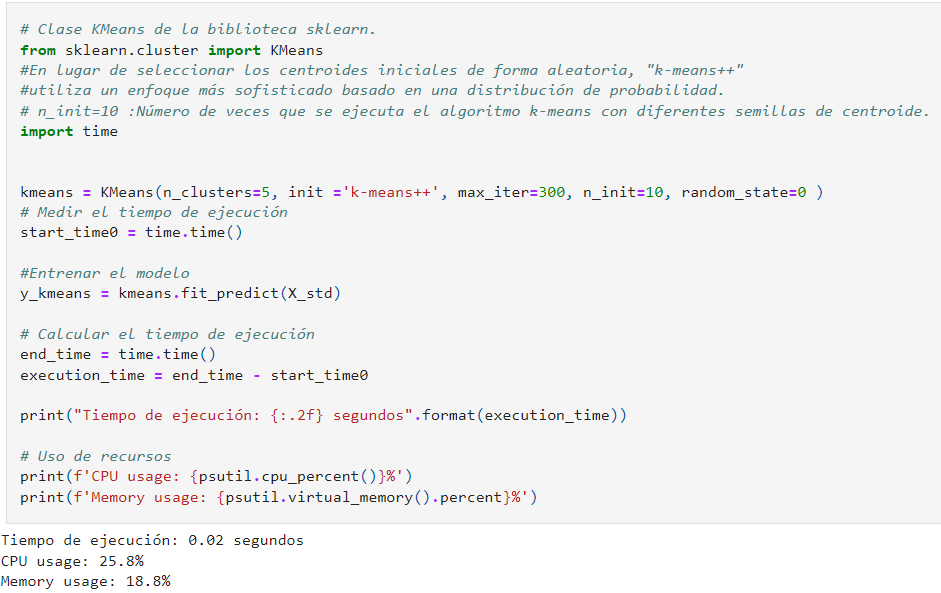

**Con PySpark -> Distribuido**

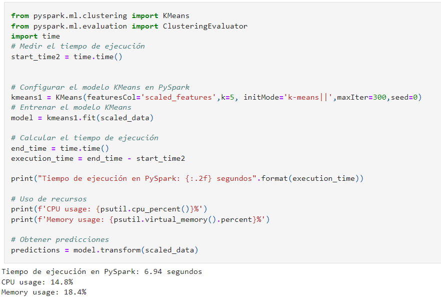

- **Algoritmo:** Algoritmo de ensamblado  (XGBoost).
- Diagrama de pasos:

  

En este algoritmo se aplicó la programación paralela y distribuida. Para realizar esto se inicializó una sesión de Spark con 4 núcleos de CPU en la máquina local. Lo cual nos va a permitir ejecuar tareas en paralelo utilizando estos 4 núcleos de la máquina local.
Luego Spark distribuye la carga y lee el archivo de CSV entre múltiples núcleos permitiendo una lectura eficiente y paralela de los datos. También se hace uso de *VectorAssembler* que transforma múltiples columnas de características en un solo vector. Después, se realiza la división de datos con *randomSplit*  diatribuyendo aleatoriamente los datos entre conjuntos de entrenamiento y prueba operando en paralelo.
En el entrenamiento del Modelo XGBoost, se distribuye el trabajo del modelo XGBoost entre 2 trabajadores.

Los resultados muestran que el algoritmo ejecutado con scikit-learn se ejecuta más rápido que PySpark esto se debe a que PySpark esta diseñado para grandes conjutos de datos. El conjunto de dato cabe en la memoria y no es grande por lo cual genera un overhead considerable, es decir que genera un tiempo adicional requerido para coordinar y transferir datos entre procesadores en un sistema paralelo. 

**Con scikit-learn**

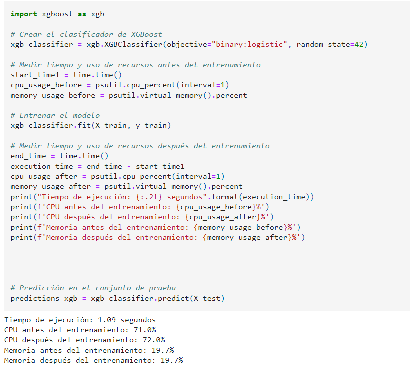

**Con PySpark -> Distribuido**

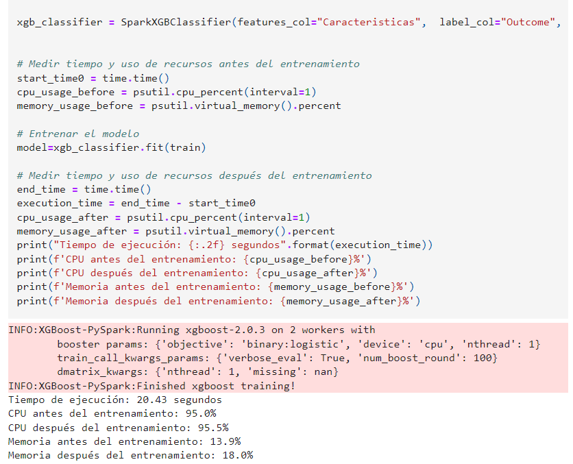


#### **Desafíos encontrados**

- **Dask:** 
- Problemas de compatibilidad con ciertas versiones de bibliotecas. Se resuelve actualizando a versiones compatibles se logra  instalando dask\_xgboots y xgboots, pero luego requieren reiniciar la ejecución, va a seguir ese mensaje.Sin embargo, correrá el programa.


- Limitaciones en la API de Dask para algoritmos de machine learning más allá de K-means, lo que restringe algunos algoritmos.
- **PySpark:** Limitaciones en la API de PySpark para  algunos algoritmos de machine learning, lo que restringe la implementación de dichos algoritmos.
- La cantidad de datos que se utilizó no es lo suficientemente grande para aplicar Dask y PySpark, por lo cual no se obtuvieron buenos resultados.
  
## 4. **Resultados**

### **Funcionalidades desarrolladas**

- Modelos de K-means, XGBoost  implementados y entrenados con Dask y PySpark. Además, en el modelo de CNN se aplicó Dask para la paralelización de los datos.
- Se utilizaron las librerías **time** y **psutil**, para evaluar el tiempo y uso de recursos.
- Además, se midió la precisión de los algoritmos. 

### **Pruebas realizadas**

- Medición de tiempo de ejecución: Para ello, se hizo uso la librería de time.
- Evaluar la utilización de recursos: Verificación del uso de los recursos con el uso de la librería psutil.. 
- Pruebas de rendimiento: Evaluación de la escalabilidad y eficiencia de los modelos.
- Evaluación del modelo con la métrica Accuracy, Silhouette Score y Davies-Bouldin Index.

### **Demostración de funcionalidades** 

#### **Captura de pantalla de la evaluación del modelo de rendimiento y de utilización de recursos con Dask (K-means)**


#### **Evaluación del modelo con la métrica Silhouette Score y Davies-Bouldin Index  (K-means)**


#### **Comentarios de los resultados:**

Al paralelizar la tarea de entrenamiento con Dask, se obtuvo un tiempo de ejecución de 0.54 segundos, con un uso de CPU del 54.8% y un uso de memoria del 13.1%. En cuanto a las métricas de evaluación:

**Silhouette Score** de 0.42: Esto indica que los clústeres están ligeramente separados entre sí, sugiriendo una calidad de clúster moderada.

**Índice de Davies-Bouldin** de 0.65: Este valor sugiere que los nodos dentro de cada clúster están relativamente bien separados, y los clústeres en general son compactos y distintos. Estas métricas reflejan que el modelo tiene una separación de clústeres razonable y que los clústeres son relativamente compactos, lo cual es un buen indicio de que el algoritmo de clustering ha funcionado de manera adecuada en el entorno paralelo proporcionado por Dask.


#### **Captura de pantalla de la evaluación del modelo con PySpark (K-means)**


#### **Evaluación del modelo con la métrica Silhouette Score (K-means)**


#### **Comentarios de los resultados:**

Al paralelizar la tarea de entrenamiento con Pyspark, se obtuvo un tiempo de ejecución de 6.94 segundos, con un uso de CPU del 14.8% y un uso de memoria del 18.4%. En cuanto a las métricas de evaluación:

**Silhouette Score** de 0.53: Esto indica que los clústeres están ligeramente separados entre sí, sugiriendo una calidad de clúster moderada.

#### **Captura de pantalla de la evaluación del modelo de rendimiento y de utilización de recursos con Dask (XGBoost)**


**Métrica:**


#### **Comentarios de los resultados:**

Al paralelizar la tarea de entrenamiento con Pyspark, se obtuvo un tiempo de ejecución de 4.92 segundos, con un uso de CPU del 100% y un uso de memoria del 13%. En cuanto a las métricas de evaluación:

#### **Gráfica de Curva ROC:**


**Accuracy:** El valor es  de 74.5%: Esto indica que el modelo está prediciendo bien. 

#### **Captura de pantalla de la evaluación del modelo de rendimiento y de utilización de recursos con Pspark (XGBoost)**


**Métrica:**


**Comentarios de los resultados:**

Al paralelizar la tarea de entrenamiento con Pyspark, se obtuvo un tiempo de ejecución de 20.43 segundos, con un uso de CPU del 95.5% y un uso de memoria del 18.0%. En cuanto a las métricas de evaluación:

**Accuracy:** El valor es  de 1: Esto indica que el modelo está prediciendo correctamente. 

#### **Captura de pantalla de la evaluación del modelo de rendimiento y de utilización de recursos con Dask (CNN - En la división de datos de train y test)**


**Comentarios de los resultados:**

Al paralelizar la tarea de entrenamiento con Pyspark, se obtuvo un tiempo de ejecución de 1.08 segundos, con un uso de CPU  después de dividir los datos del 3.1% y un uso de memoria del 82.7%. En cuanto a las métricas de evaluación:


**Accuracy:** El valor es  de 71%: Esto indica que el modelo está prediciendo correctamente. 

#### **Comparación:**

**Ejecución de CNN con un entorno no distribuido**


#### **Análisis Comparativo**

- **Tiempo de Ejecución**
- **Entorno No Distribuido:** 1.04 segundos.
- **Entorno Distribuido:** 1.08 segundos.
- **Conclusión:** El tiempo de ejecución es ligeramente mayor en el entorno distribuido. Esto puede deberse a la sobrecarga de comunicación entre los nodos en el entorno distribuido.

#### **Ejecución de XGBoost con un entorno no distribuido**


#### **Ejecución de K-means con un entorno no distribuido**


**Comentario:** Estos resultados reflejan que, aunque el entorno distribuido puede tener una ligera sobrecarga en términos de tiempo de ejecución debido a la coordinación entre nodos, ofrece ventajas significativas en términos de eficiencia en el uso de CPU y memoria. Esto es especialmente importante cuando se manejan grandes volúmenes de datos, donde la capacidad de distribuir la carga de trabajo puede reducir la presión sobre los recursos individuales y mejorar el rendimiento general del sistema.

**Ventajas de escalabilidad en entornos distribuidos**: El entorno distribuido mostró ser ligeramente más lento en términos de tiempo de ejecución para este tamaño específico de dataset debido a la sobrecarga de comunicación. Sin embargo, la eficiencia en el uso de CPU y memoria sugiere que el sistema puede manejar un aumento significativo en la carga de trabajo simplemente añadiendo más nodos al clúster.

**Limitaciones de escalabilidad en entornos no distribuidos**: El entorno no distribuido mostró ser eficiente para conjuntos de datos moderados. Sin embargo, al acercarse a los límites físicos del hardware, la eficiencia disminuye y el sistema puede volverse ineficaz o incluso fallar en manejar datasets más grandes.

## 5. **Análisis y evaluación**

### **Comparación con los objetivos del Sprint**

- **Objetivos alcanzados:** Se implementaron y evaluaron modelos con Dask y PySpark, y se documentaron los resultados.
- **Objetivos no alcanzados:** Todos los objetivos planificados fueron alcanzados.

#### **Lecciones aprendidas**

- **Qué funcionó bien:** La integración de Dask y PySpark en el entorno distribuido, pero no presenta muy buenos resultados por el tamaño de la data.
- **Qué se podría mejorar:** Optimización de la memoria en entornos distribuidos. Optimizar los algoritmos de machine learning para mejorar su rendimiento y eficiencia.
## 6. **Plan para el próximo Sprint**

#### **Objetivos del próximo Sprint**

- Optimizar los algoritmos de machine learning para mejorar su rendimiento y eficiencia.
- Preparar y presentar los resultados del proyecto.

#### **Tareas planificadas**

- Optimización de modelos: Ajustes de parámetros y manejo de excepciones. También, analizar el rendimiento.
- Identificar y abordar cuellos de botella en el rendimiento de los algoritmos.
- Ajustar hiperparámetros y realizar tuning de modelos para mejorar la precisión y la eficiencia.
- Preparación de la presentación.
