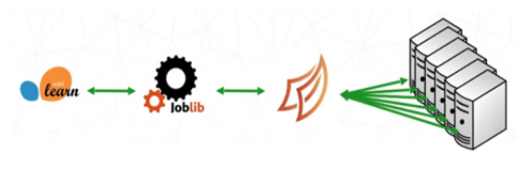

# **Reporte del Sprint 3**

## 1. **Introducción**

Después de haber utilizara la técnicas para paralelizar y distribuir en los algoritmos de machine learning con la herramientas de Dask y PySpark. Ahora en este sprint se va automatizar los algoritmos y también identificar los cuellos de botella en el rendimiento de los algoritmos mejorando así la presición y la eficiencia.

**Objetivos:**

- Optimizar los algoritmos de machine learning para mejorar su rendimiento y eficiencia.
- Preparar y presentar los resultados del proyecto.
  
**Optimización de modelo**
*Para la optimización  se hara uso de Grid search y random search: Implementar técnicas de búsqueda de hiperparámetros para optimizar los modelos de machine learning.*

**Evaluación de modelo**
*Para la evaluación de algoritmos se hara uso de la librería **time** y **psutil** para obtener el tiempo de procesamiento y supervisar el uso de recursos*


## 2. **Planificación**

### **Tareas planificadas**

- Optimización y evaluación del algoritmo de clustering(K-means):
  - Aplicación de Grid search y random search en paralelo 
  - Modificación de los parametros 
  - Verificar la diferencia de las métricas
  - Monitorear el tiempo y el uso de los recursos
- Optimización y evaluación del algoritmo de ensamblado (XgBoost):
  - Aplicación de Grid search y random search en paralelo 
  - Modificación de los parametros 
  - Verificar la diferencia de las métricas
  - Monitorear el tiempo y el uso de los recursos
- Evaluación comparativa:
  - Comparar el uso de los recursos y el tiempo de procesamiento, con los algoritmos implementados en Sklearn.
  - Análisis de resultados.
- Documentación:
- Redacción del informe sobre la implementación y los resultados.

## 3. **Implementación**

### **Descripción del trabajo realizado**

- *Aplicación de Grid search y random search en paralelo:* Se realizó a través de sklearn y también por joblib.  
- *Identificación de cuellos de botellas:* Se hizo mediante el uso de perfilación de código mediante la librería de CProfile que permite identificar cuellos de botella en términos de tiempo de cálculo como el uso de la memoria. Profile es un conjunto de estadísticas que describe con qué frecuencia y durante cuánto tiempo se ejecutaron varias partes del programa. 
- *Monitorear el tiempo y el uso de los recursos:* Se implementó con el uso de de la librerías  **time** y **psutil**, para evaluar el tiempo y uso de recursos en el momento de realizar la de la división de los datos en train y test, asimismo, para entrenamiento y la busqueda de hiperparametros optimos.

#### **Algoritmos y métodos**


- **Algoritmo:** Algoritmo de clustering (K-means).
  
Para buscar los hiperparametros optimos se hizo uso de sklearn.model_selection import GridSearchCV y el uso de n_jobs=-1. Asimismo, joblib que nos permite una ejecución en paralela basado en subprocesos y procesos, además, de que Dask puede escalar algoritmos respaldados por joblib a un clúster de máquinas, esto es se realiza gracias al backend de joblib. El backend de Dask-joblib es útil para ampliar las cargas de trabajo vinculadas a la CPU; cargas de trabajo con conjuntos de datos que caben en la memoria. Pero la operación de busqueda de hiperparametros optimos se realizará en paralelo.

- **Sklearn:**
  
##### **Aplicación de paralelización con sklearn.model_selection**

En la siguientes lineas del codigo se aplica paralelismo:
```
parametros={
    'init': ['k-means++', 'random'],
    'max_iter': [100, 200, 300],
    'n_clusters': [2,5, 8],
    'n_init': [10,20,30]
}
scoring = {
    'silhouette': make_scorer(silhouette_score),
    'davies_bouldin': make_scorer(davies_bouldin_score)
}
grid_search = GridSearchCV(
estimator=kmeans,
    param_grid=parametros,
scoring=scoring,  # Métrica de evaluación
    refit='silhouette',
    return_train_score=True,
    n_jobs=-1
)
```
Al especificar **n_jobs=-1** señala que el calculo de los hiperparámetros para el modelo KMeans con GridSearchCV y RandomizedSearchCV utilizando todos los procesadores disponibles para realizar la búsqueda de hiperparámetros en paralelo. Esto reduce el tiempo total necesario para completar la búsqueda de hiperparámetros, ya que múltiples combinaciones pueden ser evaluadas simultáneamente en lugar de secuencialmente.
Obteniendo estos resultados en un tiempo de:
```
total: 2.54 s
```
y con los siguientes parametros con GridSearchCV:
```
{'init': 'k-means++', 'max_iter': 100, 'n_clusters': 2, 'n_init': 10}
```
y con los siguientes parametros con RandomizedSearchCV:
```
{'n_init': 30, 'n_clusters': 2, 'max_iter': 300, 'init': 'random'}
```
Obteniendo el mismo resultados de las métricas:
```
silhouette_score(X_std, y_kmeans1)
0.5292698207237178
```
Este valor nos indica una buena separación de los clusters, sugiriendo que los puntos dentro de cada cluster están razonablemente cerca entre sí y los clusters están bien diferenciados.

```
davies_bouldin_score(X_std, y_kmeans1)
0.6861412675645467
```
Este resultado de esta metrica sugiere que los clusters están bien separados y formados.

A comparación de las metricas del algoritmo que no se le modifico los hiperparametros se obtuvo:

```
silhouette_score(X_std, y_kmeans)
0.4302095094703619
davies_bouldin_score(X_std, y_kmeans)
0.662115985752722
```
##### **Identificación de cuello de botella**
Para ello, se utilizó el objeto cProfile.Profile() para rastrear el tiempo de ejecución del entrenamiento del modelo.
En el resultado se observa que la función que más tiempo consume es de kmeans_single_lloyd lo cual es el metodo que permite calcular los centros, ubicar los puntos de acuerdo al centro más cercano mediante la distancia euclidiana y actualizarlos a medida que avanza la interacción.
Por lo cual, no es tan critico ya que el tiempo para hacer el entrenamiento es rápido con un tiempo total de 0.14 segundos. Con CPU usada: 67.6%
Memory usada: 23.8%.


- **Dask:**
##### **Aplicación de paralelización joblib - Dask**



Figura1:*Scikit-Learn y Joblib -> con Dask*

Joblib es un conjunto de herramientas que ofrecen para proporcionar canalización que permite transferir los datos o tareas en múltiples procesadores en paralelo. 
Por otra parte, Dask puede escalar este algoritmo ya que esta implementado con Joblib a un clúster de maquinas al proporcionar el backend de Joblib permite que distribuir el trabajo entre máquinas.

En el codigo se encuentra siguiente línea:

```
with joblib.parallel_backend('dask'):
    kmeans.fit(X_std_dask)
with joblib.parallel_backend('dask',scatter=[X_std_dask]):
    grid_search.fit(X_std_dask)
```
Para usar el backend Joblib con Dask se debe crear un Cliente y ajustar su código con *joblib.parallel_backend('dask')* que nos va a permitir escalar la tarea de entrenamiento y también en el cálculo de los hiperparametros en paralelo.

El tiempo que tardó para calcular los hiperparametros fue de 2min 54s.

A comparación de una no distribuida como sklearn. Esto se debe que la data es muy pequeña y para joblib introduce una sobrecarga adicional para gestionar múltiples procesos y coordinar la distribución de tareas. 
La sobrecarga de crear y gestionar múltiples procesos puede superar las ganancias obtenidas por la paralelización.

**Asimismo, se aplicó un perfilación de una parte del código en Dask Distribuido proque el tiempo de entrenamiento es un total de 9.63 segundos, con CPU en uso de 36.3% y Memoria 28.2%** para mejorar el redimiento del algoritmo identificando los cuellos de botella tanto en términos de tiempo como de uso de la memoria, en el informe que nos presenta el perfilado del codigo de entrenamiento del modelo. Y el metodo con más uso es Bloqueos de Hilo (method 'acquire' of '_thread.lock' objects), esto se debe que hay hilos compitiendo por el bloqueo y podría crear un cuello de botella.

Para solucionar esto:
Uno de los metodos es redistribuir las tareas en el cluster para asegurarse de que la carga de trabajo esté equilibrada entre los diferentes trabajadores con la ayuda de client.rebalance(), lo que puede reducir la contención de recursos y mejorar el rendimiento general. Luego de aplicar esto se comprueba y el tiempo en entrenar es un total de 0.03 segundos. Lo cual, es una mejora significativa, además, del uso de la CPU : 44.2% y Memoria: 22.9%.


- **Algoritmo:** Algoritmo de emsamblado (XGBoost):
  
- **Sklearn:**
  
##### **Aplicación de paralelización con sklearn.model_selection**

En la siguientes lineas del codigo se aplica paralelismo:
```

parametros = {
    'max_depth': [3, 4, 5],
    'eta': [ 1, 0.1, 0.2],
    'subsample': [0.5, 0.7, 1.0],
    'objective': ['binary:logistic']
}
scoring = {
    'accuracy': make_scorer(accuracy_score)
}
grid_search = GridSearchCV(
estimator=xgb.XGBClassifier(),
    param_grid=parametros,
scoring=scoring,  # Métrica de evaluación
    refit='accuracy',
    return_train_score=True,
    n_jobs=-1
)
```
**n_jobs=-1:** Señala que el cálculo de los hiperparámetros para el modelo KMeans con GridSearchCV y RandomizedSearchCV, se realice en paralelo utilizando todos los procesadores disponibles, lo cual puede acelerar significativamente el proceso.

Obteniendo estos resultados en un tiempo de respectivamente:
```
total: 3.59  s
total: 2.46 s
```
y con los siguientes parametros con GridSearchCV:
```
{'eta': 1, 'max_depth': 3, 'objective': 'binary:logistic', 'subsample': 0.5}
```
y con los siguientes parametros con RandomizedSearchCV:
```
{'subsample': 0.5, 'objective': 'binary:logistic', 'max_depth': 3, 'eta': 0.1}
```
- **Dask:**
  
 ##### **Modificación de hiperparametros**
 
Al aplicar estos hiperparametros en el entrenamiento con dask del modelo XGBoost se obtiene un valor de accuracy de 75.84% a comparación del accuracy obtenido en el sprint2 es de 74.50%.
Asimismo, a comparción de la aplicación sklearn se obtuvo un accuracy de 75.32%. Lo cual, se puede obsevar una mejora en la métrica accuracy.

También en esta implementación se aplico el perfilado del codigo de entrenamiento para verificar si existe cuello de botella y mejorar el rendimiento ya que el entrenamiento tiene un tiempo de 4.26 segundos. 
``` 
121 function calls in 9.094 seconds

   Ordered by: internal time
   List reduced from 67 to 10 due to restriction <10>

   ncalls  tottime  percall  cumtime  percall filename:lineno(function)
        4    9.068    2.267    9.068    2.267 {method 'acquire' of '_thread.lock' objects}
        1    0.011    0.011    0.011    0.011 {method 'send' of '_socket.socket' objects}
        2    0.009    0.004    0.014    0.007 contextlib.py:279(helper)
        2    0.005    0.003    0.005    0.003 contextlib.py:102(__init__)
        2    0.000    0.000    0.000    0.000 {built-in method builtins.compile}
        2    0.000    0.000    9.080    4.540 interactiveshell.py:3512(run_code)
        1    0.000    0.000    9.079    9.079 utils.py:376(sync)
        1    0.000    0.000    0.000    0.000 functools.py:35(update_wrapper)
        1    0.000    0.000    9.079    9.079 utils.py:347(sync)
        2    0.000    0.000    0.000    0.000 interactiveshell.py:3337(_update_code_co_name)
``` 
En los resultados se puede observar que el mayor tiempo esta en el método de 'acquire' of '_thread.lock' objects. Lo cual, esto surge cuando gran parte del tiempo se pasa esperando la adquisición de un bloqueo (lock), debido a la desigualdad de trabajo entre los nodos. 

Por otra parte, se aplicó el client.rebalance() que ayuda a nivelar la carga y potencialmente reducir los tiempos de espera asociados con ciertas tareas distribuidas. Mejorando la eficiencia general de la ejecución distribuida en Dask.


- **PySpark:**
  
- **Algoritmo:** Algoritmo de clustering (XGBoost).
  En este algoritmo se aplicó el perfilado para identificar cuellos de botella y mejorar su rendimiento.
  Ya que, al ejecutar se obtuvo 9.02 segundos.
  Al aplicar el perfilado se obtuvo el siguiente informe:
``` 
  Ordered by: internal time
   List reduced from 602 to 10 due to restriction <10>

   ncalls  tottime  percall  cumtime  percall filename:lineno(function)
      311    8.338    0.027    8.338    0.027 {method 'recv_into' of '_socket.socket' objects}
      297    0.039    0.000    0.039    0.000 {method 'sendall' of '_socket.socket' objects}
     1056    0.013    0.000    0.013    0.000 {built-in method builtins.getattr}
        1    0.008    0.008    0.008    0.008 core.py:1840(save_config)
     4589    0.006    0.000    0.006    0.000 {built-in method builtins.isinstance}
        8    0.005    0.001    0.005    0.001 socket.py:545(send)
        1    0.004    0.004    0.004    0.004 core.py:2562(load_model)
        1    0.004    0.004    0.016    0.016 __init__.py:267(<listcomp>)
      297    0.004    0.000    8.378    0.028 java_gateway.py:1178(send_command)
        3    0.003    0.001    0.005    0.002 cloudpickle.py:254(_find_imported_submodules)
``` 
Los valores más altos son los metodos  *'recv_into' of '_socket.socket' objects* y *method 'sendall' of '_socket.socket' objects*. Que se dedican a recepción de datos a través de sockets y enviar datos a través de sockets. 

Después, de identificar los valores más altos se utiliza la herramienta *train_data.persist()* que es útil para mejorar el rendimiento al minimizar la comunicación de red y optimizar el acceso a los datos.


#### **Desafíos encontrados**

- **Dask:** 
- Problemas en aplicar Grid search.
- Limitaciones en la API de Dask para algoritmos de machine learning más allá de K-means, lo que restringe algunos algoritmos.
- **PySpark:** Problemas en aplicar Grid search.
- La cantidad de datos que se utilizó no es lo suficientemente grande para aplicar Dask y PySpark.
  
## 4. **Resultados**

### **Funcionalidades desarrolladas**

- Se aplico paralelismo para calcular los hiperparametros optimos para los modelos de K-means, XGBoost  implementados y entrenados con Dask y PySpark. 
- Se utilizaron las librerías **time** y **psutil**, para evaluar el tiempo y uso de recursos.
- Se utilizó cProfile para perfilar el codigo de entrenamiento de los modelo para la identificación de cuello de botella
- Además, se midió la precisión de los algoritmos. 

### **Pruebas realizadas**

- Medición de tiempo de ejecución: Para ello, se hizo uso la librería de time.
- Evaluar la utilización de recursos: Verificación del uso de los recursos con el uso de la librería psutil.. 
- Pruebas de rendimiento: Evaluación de la escalabilidad y eficiencia de los modelos.
- Perfilado: Para la identificación de cuello de botella, mediante terminos de tiempo y el uso de la memoria.
- Evaluación del modelo con la métrica Accuracy, Silhouette Score y Davies-Bouldin Index.

## 5. **Análisis y evaluación**

### **Comparación con los objetivos del Sprint**

- **Objetivos alcanzados:** Optimizar los algoritmos de machine learning, y se documentaron los resultados.
- **Objetivos no alcanzados:** Optimizar de machine learning directamente en un entorno distribuido del modelo XGBoost.

#### **Lecciones aprendidas**

- **Qué funcionó bien:** Optimizar los algoritmos de machine learning y mejoras en el rendimiento
- **Qué se podría mejorar:** Optimizar los algoritmos de machine learning en entornos distribuidos. Además, aplicarlo con más cantidad de datos. 
  
